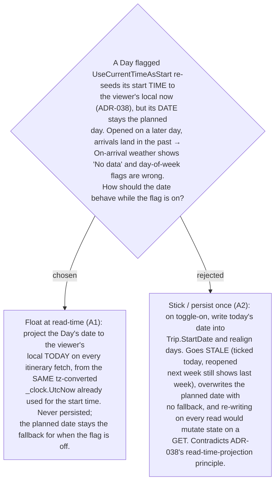

# ADR-054: "Current-time start" also tracks **today's date**, projected read-time (never persisted)

**Date:** 2026-07-13
**Status:** Accepted
**Relates to:** ADR-038 (current-time start re-seeds the start *time* to the viewer's local now — this ADR extends the same mode to the *date*), ADR-013 (day-start commit-on-change), ADR-029/031 (On-arrival weather uses the Day date), ADR-008 (Smart Schedule cascade + opening-hours flags use the Day's day-of-week). Tracking issue: #TBD.

## Context

A per-Day **Current-time start** flag (`UseCurrentTimeAsStart`, UI "ใช้เวลาปัจจุบันเสมอ")
re-seeds the Day's **start time** to the viewer's local "now" on every itinerary
fetch (ADR-038) — read-time only, the persisted `DayStartTime` untouched as the
fallback. But the Day's **date** was left on the originally-planned day. That is
incoherent: the whole point of the flag is "this is my plan for *whenever* I open
it." The date is not cosmetic — it feeds:

- **On-arrival weather** — `arrivalIso(day.date, arrival)` builds each Stop's arrival
  timestamp from the Day date. With the time snapped to now but the date stuck in the
  past, every arrival is a past datetime → the client's horizon gate resolves them all
  to **No weather data** (ADR-031).
- **Opening-hours / off-window Timing flags** — `dayOfWeek(day.date)` picks which day's
  best-time window and opening hours to check. A stale date checks the wrong weekday.

The user pointed at the top-bar date (point 2 in the mock) and said: while the box is
ticked, it should be **today**.

## Decision

**A1 — Float at read-time.** While a Day is flagged `UseCurrentTimeAsStart` **on a
single-day trip** (scope — see ADR-055), its effective **date** is the viewer's local
**today**, computed from the *same*
`TimeZoneInfo.ConvertTimeFromUtc(_clock.UtcNow, tz)` value `GetItineraryHandler`
already computes for the start time (`.Date` for the day, `.TimeOfDay` for the start).
No new time-zone plumbing, no extra clock read. It is **never persisted**: the
domain `ItineraryDay.Date` / `Trip.StartDate` stay the planned values and are the
fallback the moment the flag is turned off — exactly the fallback contract ADR-038
established for the start time.

(Rejected — **A2, stick/persist once:** writing today's date on toggle-on is simpler
to display but goes stale the next day, destroys the planned date with no fallback,
and the only way to keep it fresh — re-writing on every read — mutates persisted
state inside a GET. This is the same trap ADR-038 rejected for the time.)

## Consequences

**Positive:** the flagged Day is a true "run-it-today" plan — date and start time both
track the present, so On-arrival weather, day-of-week opening-hours flags, and the
cascade are all internally consistent. Zero new time-zone input (reuses ADR-038's
`tz`). Non-destructive: unticking the box restores the planned date.

**Negative:** the effective date now diverges from the persisted `Date` while the flag
is on, so any consumer reading the DTO date must understand it is "today, projected"
— documented here and carried in the DTO exactly as the projected start time already is.
The top-bar surface (`Trip.StartDate`, a separate query) needs its own wiring to reflect
this — see the follow-on ADR.
