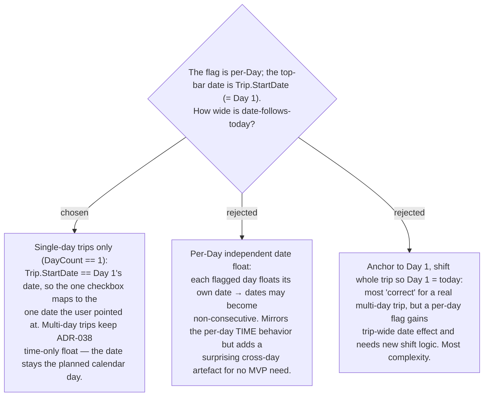

# ADR-055: Date-follows-today is scoped to **single-day trips**; multi-day keeps the time-only behavior

**Date:** 2026-07-13
**Status:** Accepted
**Relates to:** ADR-054 (the float principle this scopes), ADR-038 (per-Day current-time-start, time-only), ADR-009 (MVP scope discipline — defer complex extras).

## Context

`UseCurrentTimeAsStart` is a per-**Day** flag; the top-bar date the user pointed at is
the **Trip**'s `StartDate`, which equals **Day 1**'s date. On a **single-day** trip
those are the same date, so "tick the box → the date shows today" is a clean 1:1 map.
On a **multi-day** trip it is not: flagging one day raises whether only that day's date
floats (breaking consecutiveness), or the whole trip shifts to start today — both add
concepts and logic with no demonstrated MVP need. Multi-day trips also typically pin to
**booked** calendar dates (hotels, flights) that should *not* silently move to today.

## Decision

Date-follows-today applies **only when the trip has exactly one Day** (`days.Count == 1`)
and that Day is flagged `UseCurrentTimeAsStart`. `GetItineraryHandler` guards the date
projection on this single-day condition; the start-**time** projection (ADR-038) is
unchanged and still applies per-Day on trips of any length. On a multi-day trip a flagged
day therefore floats its **start time** but keeps its **planned date** — a deliberate,
documented asymmetry. Multi-day date semantics (per-day float vs whole-trip shift) are
**deferred to Phase 2**.

## Consequences

**Positive:** the smallest coherent MVP — exactly the "run-this-day-trip today" pattern in
the mock, with no non-consecutive-date or trip-shift questions to answer now. Multi-day
trips are wholly unaffected (booked dates stay put).

**Negative:** a flag on a multi-day trip floats the time but not the date — someone who
expects symmetry may be surprised; the UI copy/spec should make the single-day scope legible.
Revisit if a real multi-day "evergreen trip" need appears.

**Phase-2 implementation caveat (surfaced by scrutiny 2026-07-13):** `GetItineraryHandler`
orders days by their **persisted** `Date` (`.OrderBy(d => d.Date)`) *before* the DTO-assembly
loop projects the date. On a single-day trip this is moot (one Day). Any future multi-day
date-float must re-establish ordering **after** projection — projecting per-Day dates onto a
list ordered by the old persisted dates could emit out-of-order days. The single-day scope
sidesteps this today; whoever opens Phase 2 must handle it.
