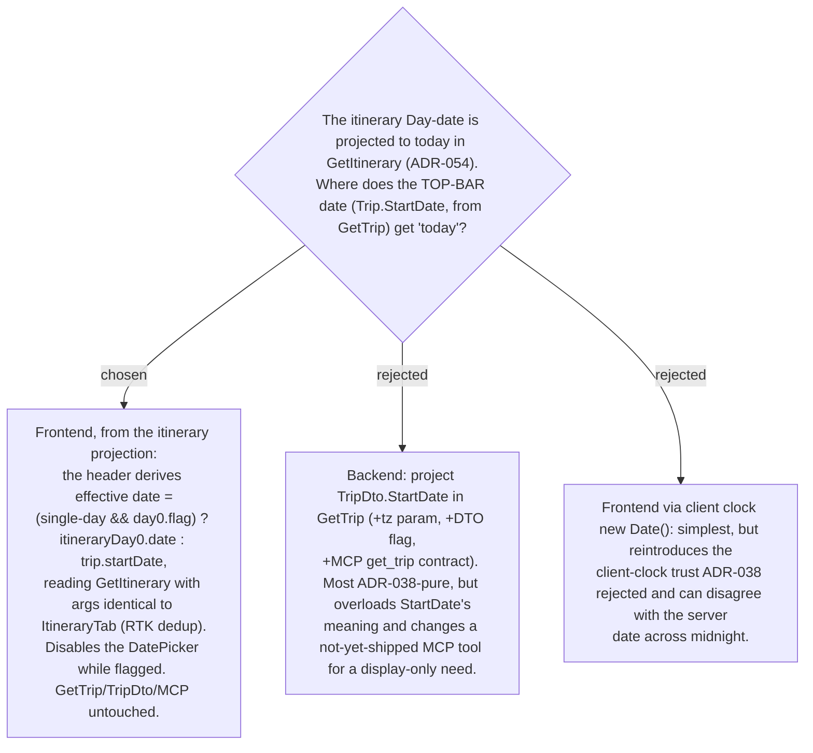

# ADR-056: The top-bar date reflects current-time-start by sourcing the itinerary's projected date on the client; GetTrip / TripDto / MCP stay unchanged

**Date:** 2026-07-13
**Status:** Accepted
**Relates to:** ADR-054 (the read-time date projection this surfaces), ADR-055 (single-day scope), ADR-038 (backend-authoritative projection for the start time; disabled editor while flag on), ADR-012/013 (inline tap-to-edit date, commit-on-change).



## Context

The top-bar date (point 2 in the mock) is rendered by `TripDateEditor` from
`TripDto.StartDate`, fetched via `GetTrip` — which is **also** consumed by the HTTP
controller and the MCP `get_trip` tool (`TripTools.cs`). The "today" value already exists
after ADR-054: `GetItineraryHandler` projects the single Day's `Date` to the viewer's local
today (server-resolved, no client clock). The only question is how the top bar — a separate
query — shows it, without changing contracts more than needed.

## Decision

**Frontend, sourced from the itinerary projection.** `TripDetailPage`'s header reads
`useGetItineraryQuery` with **the same args** `ItineraryTab` uses (`{tripId, tz:
getViewerTimeZone(), lat, lng}` from the store), so RTK Query serves both from **one**
cache entry / request. The displayed date is:

```
effectiveStartDate = (trip.dayCount === 1 && days?.[0]?.useCurrentTimeAsStart)
    ? days[0].date            // server-projected "today" (ADR-054)
    : trip.startDate          // persisted planned date
```

While `effectiveStartDate` comes from the flag, the `DatePicker` is **disabled** — mirroring
how `DayStartEditor` disables the `TimePicker` (and hides "ตอนนี้") while the flag is on
(ADR-038), because a pick would just be overwritten by the projection. `GetTrip`, `TripDto`,
and the MCP `get_trip` tool are **not** changed — they keep returning the persisted planned
`StartDate`.

## Consequences

**Positive:** no new backend or MCP contract; no client-clock trust (the date shown is the
server's projected value); toggling the flag already invalidates `TripItinerary`
(`setDayUseCurrentTime`), so the header **re-derives automatically** — untick → `days[0]`
flag false → falls back to the planned `trip.startDate`. Builds entirely on the
GetItinerary change ADR-054 already requires.

**Negative:** the header now depends on the itinerary query (deduped, so no extra network
cost, but a new coupling); a brief pre-load render may show the planned date until
`GetItinerary` resolves, then swap to today; and the MCP `get_trip` tool + the trips-list
card still surface the persisted planned `StartDate` (accepted — the list reads as "planned",
the open trip reads as "live"). Because this is a display path with **no** component/visual
test harness (project CLAUDE.md), it must be verified interactively before it's called done.
