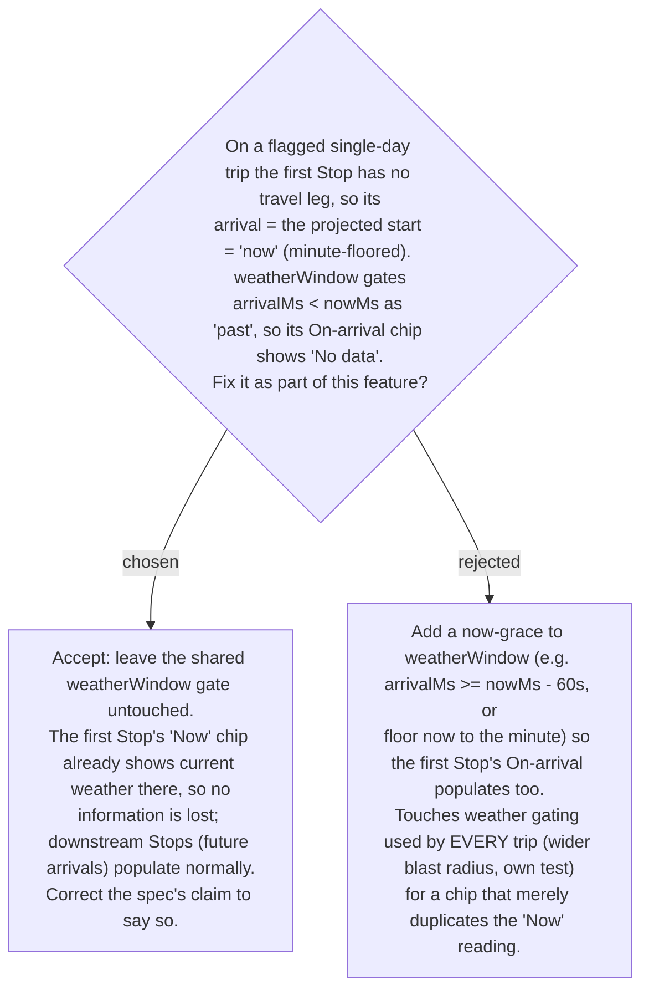

# ADR-057: The first Stop's On-arrival weather (arrival ≈ now) stays "No data"; no now-grace is added to the shared weather gate

**Date:** 2026-07-13
**Status:** Accepted
**Relates to:** ADR-054 (date-follows-today, the change that surfaced this), ADR-029/030/031 (weather readings + horizon gate). Found by the adversarial spec-verification pass on 2026-07-13.

## Context

The adversarial verification of the date-follows-today spec (ADR-054) confirmed a real
inaccuracy in its value claim: for the **first** Stop of a flagged single-day trip in the
common no-geolocation case, `arrival == day start == "now"` (minute-floored, seconds zeroed
by `arrivalIso`). `weatherWindow` classifies `arrivalMs < nowMs` as `'past'` with **no grace**
(`weather.ts`), so `useStopWeather` gates the first Stop out of the On-arrival batch and shows
**"No data"**. Downstream Stops (arrival = now + dwell + legs) are future-dated and populate
correctly. Crucially this "arrival ≈ now ⇒ On-arrival No-data" is a **pre-existing**
`weatherWindow` behaviour — it already happens whenever a day starts at ~now (e.g. tapping the
"ตอนนี้" button); the date-follows-today feature only makes it common.

## Decision

**Accept the behaviour; do not bundle a shared-logic change into this feature.** The first
Stop's **On-arrival** chip stays "No data"; its **"Now"** chip already shows the current
weather at that location, so nothing is actually missing. The `weatherWindow` gate is left
exactly as-is — it is shared by every trip, and widening it (a now-grace) for a chip that only
duplicates the Now reading is disproportionate blast radius for marginal value. The spec's
Problem / blast-radius / interactive-verification wording is corrected to state honestly that
the fix populates On-arrival for **downstream** Stops and that the first Stop's On-arrival ≈ now
is covered by its Now chip.

(Rejected — a `weatherWindow` now-grace: it would make the first Stop's On-arrival populate, but
it changes gating for **all** trips, needs its own test, and addresses a pre-existing edge that
is orthogonal to this feature. If ever wanted, it should be its own scoped change, not smuggled
in here.)

## Consequences

**Positive:** this feature's diff stays confined to `GetItineraryHandler` (date projection) +
the SPA header wiring; no change to shared weather gating and no risk to other trips' weather.
The spec now describes the real behaviour, so interactive verification won't read the first
Stop's "No data" as a regression.

**Negative:** a user may notice the first Stop uniquely shows On-arrival "No data" while its Now
chip is populated — a minor visual asymmetry, considered acceptable (the information is present
in the Now chip). Revisit only if a scoped weather-gating improvement is taken up independently.
