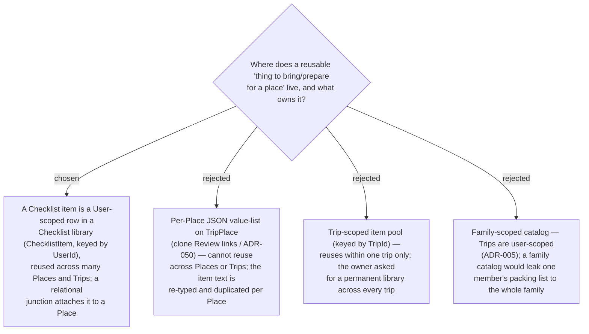

# ADR-058: A Checklist item is a User-scoped reusable library entity, not per-Place JSON

**Date:** 2026-07-13
**Status:** Accepted
**Relates to:** ADR-005 (Trip is user-scoped), ADR-007 (a **Place**/TripPlace is a per-trip snapshot —
there is no global shared Place entity), ADR-049/050 (**Review link** — the per-Place JSON value-list
whose reuse model this decision deliberately *rejects*). Implements issue
[#23](https://github.com/ThodsaphonSonthiphin/MenuNest/issues/23) ("add check list item that need for
the place in the modal detail"), with the owner's added constraint: "ไอเท็มแต่ละรายการควรเก็บแยก มันควร
เอาไปใช้ได้หลายสถานที่" (each item is stored separately and reusable across many places).

## Context

Issue #23 asks for a checklist of items needed for a **Place**, shown in the **Stop editor** modal.
The freshest precedent is the **Review link** (ADR-049/050): a per-Place list persisted as a JSON
column on `TripPlace`, which *explicitly rejected* a shared/relational model and accepted "re-enter
per trip" as the cost — correct there, because a review URL describes one specific venue and does not
recur.

A checklist item is the opposite. "ร่ม / พาสปอร์ต / ครีมกันแดด" recur across many places and many
trips, so the value of the feature *is* the reuse. The owner made this explicit: items must be stored
separately and be usable across many places. That requirement cannot be met by per-Place JSON — a JSON
blob owned by one `TripPlace` row is un-shareable by construction, and `TripPlace` is itself a per-trip
snapshot (ADR-007), so JSON would duplicate the item text per place *and* per trip.

The codebase today has **no** shared library/catalog entity in the Trip module; the only ownership
roots are **User** and **Family**. Trips are **user-scoped** (ADR-005).

## Decision

**A Checklist item is a User-scoped, reusable entity — a row in the User's Checklist library — not
per-Place JSON.**

- **New relational entity `ChecklistItem`**, keyed by `UserId`, holding the item's **name**. This is
  the "stored separately" the owner asked for: the item text lives once, in the library, and many
  Places reference it.
- **Owned by the User, cross-trip.** A Checklist item is reused across every **Place** and every
  **Trip** the User owns. This mirrors the User-scoped entities that already exist in the Health module
  (Drug, Symptom), so it is not a new *kind* of ownership for the codebase — only new to the Trip
  module.
- **Attachment is a separate relational junction** (`PlaceChecklistEntry`), decided in ADR-059 — a
  Place references library items through it; the library item never stores which Places use it.
- **Identity by name, unique per User** (case-insensitive, trimmed) — so typing an existing name
  reuses the same library row rather than creating a duplicate (the mechanism — filtered unique index,
  mirroring `TripPlace`'s `(TripId, GooglePlaceId)` index — is an implementation detail for the plan).
- **Reference/display data only.** Like Review links and Visited, a Checklist item never feeds the
  Smart Schedule, Timing flags, or any computed value.

### Rejected

- **Per-Place JSON value-list (B), i.e. clone ADR-050.** Cheapest to build (the pattern is fresh and
  proven) but it structurally *cannot* reuse across Places or Trips — it would re-type and duplicate
  every item per place. That directly contradicts the owner's requirement, so the cost that was
  acceptable for Review links is disqualifying here.
- **Trip-scoped item pool (C).** Reuses within one trip but resets every new trip; the owner asked for
  a permanent personal library that survives across all trips.
- **Family-scoped catalog (D).** Trips are user-scoped (ADR-005); a family-scoped library would surface
  one member's private packing list to the whole family and mismatch the ownership root of everything
  it attaches to.

## Consequences

**Positive:** the reuse the owner asked for works by construction — define "ร่ม" once, attach it to any
place in any trip; the item text is never duplicated; the model is normalized and queryable (unlike a
JSON blob); and User-scoped ownership reuses an existing pattern (Health module).

**Negative / deferred:** this is the Trip module's **first** relational child-with-junction (two new
tables + a migration that must be applied to prod by hand — see CLAUDE.md), a larger write-path than
the JSON precedent. The Trip aggregate stays FK-only (no EF navigation graph), consistent with the rest
of the module. Library-item **editing/deletion UI** is out of Phase 1 (ADR-061); the concrete
attachment shape, lifecycle, and checked-state model are decided in **ADR-059**, the API/MCP surface in
**ADR-060**, and the Phase-1 UI scope in **ADR-061**.
