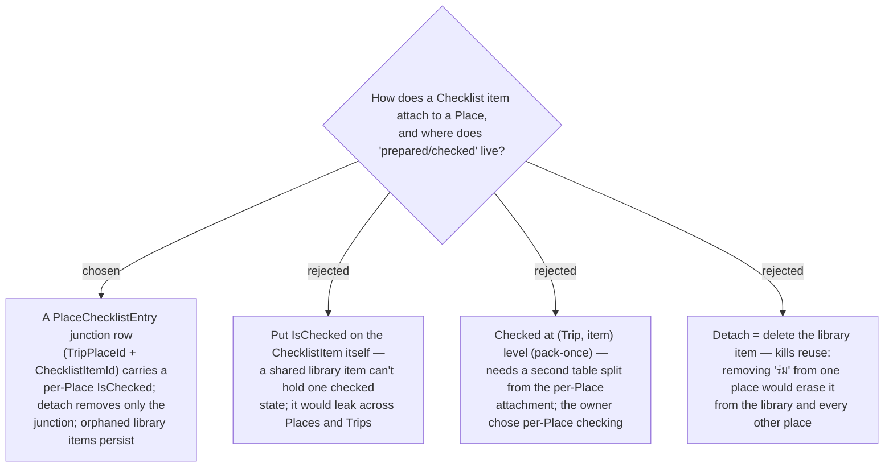

# ADR-059: A Place checklist entry is a junction carrying per-Place checked state; detach never deletes the library item

**Date:** 2026-07-13
**Status:** Accepted
**Relates to:** ADR-058 (Checklist item is a User-scoped reusable library entity), ADR-039/041/042
(**Visited** — the per-Stop display marker + optimistic-toggle precedent this mirrors for the checkbox),
ADR-007 (a **Place**/TripPlace is per-trip). Implements issue
[#23](https://github.com/ThodsaphonSonthiphin/MenuNest/issues/23).

## Context

Following ADR-058, a **Checklist item** is a User-scoped library row reused across many Places. Issue
#23 shows the checklist inside one **Place**'s modal with checkboxes, so two things must be modelled
beyond the library row: *which* items a given Place needs, and *whether each is prepared* for that
Place. The owner decided the **checked** state is **per-Place** (the same item on two Places is checked
independently), and that items are attached **implicitly** — typed in the modal with autocomplete from
the library, creating a library item on a new name and reusing it on an existing one.

## Decision

**Attachment is a relational junction, `PlaceChecklistEntry`, and it — not the library item — owns the
per-Place checked state.**

- **`PlaceChecklistEntry` = `(TripPlaceId, ChecklistItemId, IsChecked)`** plus its own id. It joins one
  **Place** to one **Checklist item** and carries the per-Place **checked** boolean. A Place's
  **Checklist** is its set of entries.
- **Checked is per-Place.** The same Checklist item attached to two Places has two independent
  `IsChecked` values — resolving the owner's Q3 choice. "เตรียมแล้ว" answers "is *this Place* ready?".
- **Attach is create-or-reuse by name.** Typing a name that matches an existing library item (per
  ADR-058's per-User uniqueness) attaches that item; a new name creates the library item first, then
  attaches. No separate library-management step.
- **One entry per (Place, item).** A unique constraint on `(TripPlaceId, ChecklistItemId)` prevents
  attaching the same item to a Place twice.
- **Detach removes only the junction.** Removing an item from a Place deletes the `PlaceChecklistEntry`
  row; the underlying `ChecklistItem` stays in the **Checklist library**. An item with zero entries
  remains as an autocomplete suggestion — pruning it would defeat the reuse that is the whole point.
- **Checked toggles optimistically, like Visited** (ADR-042): a lightweight non-invalidating write, not
  a full-day itinerary refetch.
- **Cascade / lifecycle.** `PlaceChecklistEntry → TripPlace` is `OnDelete(Cascade)` (deleting a Place,
  or a Trip that cascades its Places, removes the Place's entries). `PlaceChecklistEntry →
  ChecklistItem` is **NoAction/Restrict** so deleting a Place can **never** touch the library. Deleting
  a library item is out of Phase 1 (ADR-061), so no cascade flows from the library side yet.

### Rejected

- **`IsChecked` on the `ChecklistItem` (B).** A shared library item cannot hold one Place's checked
  state — it would leak the "prepared" flag across every Place and every Trip that reuses the item.
- **Checked at (Trip, item) / pack-once (C).** More faithful to "you pack the umbrella once," but it
  splits *attachment* (per-Place) from *checked* (per-Trip) into two structures. The owner chose
  per-Place checking (self-contained "is this place ready?"), which the single junction models cleanly.
- **Detach = delete the library item (D).** Directly kills the ADR-058 reuse guarantee: detaching "ร่ม"
  from one beach would erase it from the library and every other place using it.

## Consequences

**Positive:** one junction row is the entire per-Place state (attached + checked); reuse is safe
(detach is local); the checkbox reuses the proven optimistic-Visited write; cascade rules keep library
items immortal against Place/Trip deletion.

**Negative / deferred:** orphaned library items (zero entries) accumulate with no Phase-1 way to delete
them — accepted, since they are exactly the autocomplete suggestions the library exists to provide;
a **manage/delete library** surface and item **rename** are Phase 2. Because attach can *create* a
library row, the write is not idempotent on name collisions across concurrent requests — the per-User
unique index (ADR-058) is the backstop, and the create-or-reuse handler resolves to the existing row.
The API and MCP surface for attach/detach/toggle is decided in **ADR-060**.
