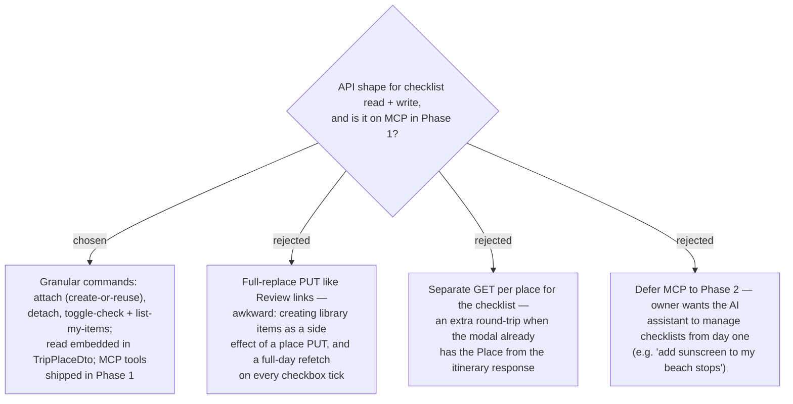

# ADR-060: Checklist uses granular attach/detach/toggle endpoints (not review-links full-replace), read via TripPlaceDto embed, exposed over MCP in Phase 1

**Date:** 2026-07-13
**Status:** Accepted
**Relates to:** ADR-058 (User-scoped library), ADR-059 (per-Place junction + optimistic checked),
ADR-051/053 (**Review links** — the *full-replace* write-path this decision deliberately *diverges*
from), ADR-042 (**Visited** — optimistic non-invalidating write), ADR-034 (Trips exposed over MCP).

## Context

The **Review link** write-path is *full-replace* (ADR-053): the client sends the whole list and the
`update_trip_place` PUT invalidates and refetches the entire day (accepted because review editing is
rare). The checklist is different on two counts decided upstream: (1) attach can **create** a
User-scoped library item as a side effect (ADR-058/059), which does not belong inside a `TripPlace`
PUT, and (2) the **checked** toggle is a frequent, per-Place action the owner wants to feel instant —
the exact profile of the optimistic, non-invalidating **Visited** write (ADR-042), not a full-day
refetch. The owner also chose to expose the feature over **MCP in Phase 1** (ADR-034: every Trip use
case is an MCP tool).

## Decision

**Granular commands, read embedded in the Place DTO, and MCP tools in Phase 1.**

- **Write — three granular operations, not full-replace:**
  - **attach** — attach a Checklist item to a Place by **name** (create-or-reuse per ADR-059); returns
    the created/updated **Place checklist entry**.
  - **detach** — remove a **Place checklist entry** (junction only; library item persists, ADR-059).
  - **toggle-check** — set a `PlaceChecklistEntry.IsChecked`; **optimistic, non-invalidating** like
    Visited (ADR-042) — it must not trigger a full-day itinerary refetch (no Routes/Weather re-bill).
- **Read — embed the checklist in `TripPlaceDto`.** The itinerary/places response already carries each
  `TripPlaceDto` to the modal (ADR-051 precedent for Review links); the Place's entries + checked state
  ride along, so the modal needs no extra round-trip.
- **Autocomplete — a User-scoped `list my checklist items`** query returns the **Checklist library**
  for typeahead. This is the one genuinely user-scoped (not trip-scoped) endpoint.
- **MCP — ship in Phase 1.** Mirror the operations as MCP tools alongside the existing `TripTools`
  (e.g. `list_checklist_items`, `attach_checklist_item`, `detach_checklist_item`,
  `set_checklist_item_checked`). Read is automatic via the embedded `TripPlaceDto`, matching how Review
  links are read over MCP (ADR-053).

### Rejected

- **Full-replace PUT like Review links (B).** Forces library-item *creation* to happen as a side effect
  of a place update, and re-runs a full-day refetch on every checkbox tick — wrong for a frequent
  optimistic toggle.
- **Separate GET per place (C).** An extra round-trip the modal does not need — it already holds the
  `TripPlaceDto` from the itinerary response.
- **Defer MCP to Phase 2 (D).** The owner wants the assistant to manage checklists immediately; MCP is
  the module's standing convention (ADR-034), so adding it later would be an inconsistency, not a
  saving.

## Consequences

**Positive:** the checkbox is instant (optimistic, no re-bill); attach/detach map cleanly to
create-or-reuse and junction-delete; the modal reads with zero extra requests; MCP stays consistent
with the rest of Trips from day one.

**Negative / deferred:** more endpoints/commands than the single review-links PUT (attach, detach,
toggle, list) plus their MCP twins — a wider surface, but each is small and matches an existing pattern
(Visited toggle, list queries). Optimistic toggle needs the same cache-reconciliation care as Visited
(ADR-042); the `list my checklist items` query is the first user-scoped (non-trip) read in the Trip
frontend and needs its own RTK cache tag. The Phase-1 **UI** scope is decided in **ADR-061**.
