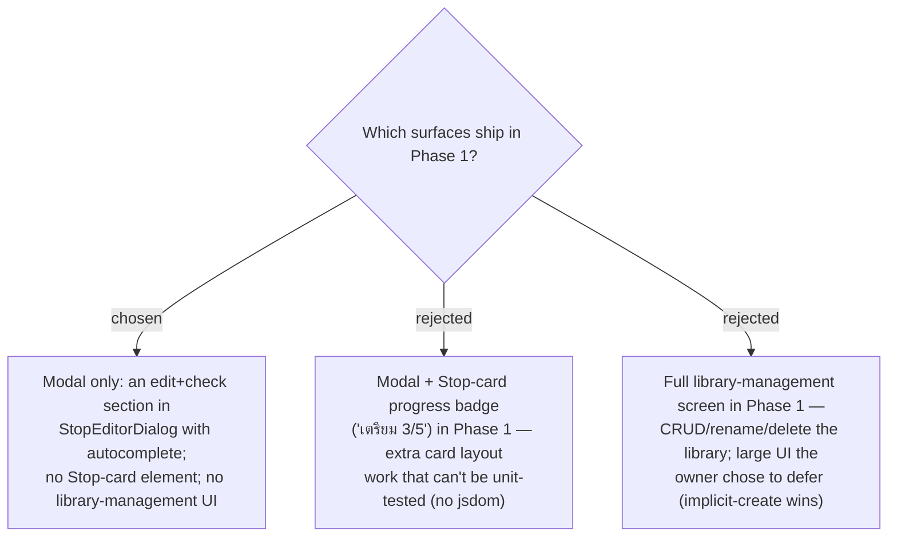

# ADR-061: Phase 1 surfaces the checklist in the Stop editor modal only; the Stop-card badge and library-management UI are Phase 2

**Date:** 2026-07-13
**Status:** Accepted
**Relates to:** ADR-058/059/060 (the checklist model, junction, and API), ADR-052 (**Review link** card
icon + portal popover — the card-surface precedent deferred here), the MenuNest MVP-scoping habit of
cutting nice-to-haves to Phase 2 (ADR-009 spirit). Implements issue
[#23](https://github.com/ThodsaphonSonthiphin/MenuNest/issues/23), whose text scopes the feature to
"in the modal detail."

## Context

Issue #23 scopes the checklist to the **Stop editor** modal ("in the modal detail"). The **Review
link** feature (ADR-052) additionally put an icon + count badge with a portal popover on the **Stop
card** — useful, but exactly the kind of DOM-interaction UI that the SPA's test harness **cannot**
cover (vitest runs in `node`, no jsdom/RTL — CLAUDE.md), so it must be verified by hand. The owner chose
implicit item creation with autocomplete (ADR-059), which means no library-management screen is needed
to use the feature.

## Decision

**Phase 1 is the modal, and only the modal.**

- **In scope (Phase 1):** a checklist **section inside `StopEditorDialog`** mirroring the review-links
  section — a list of the Place's **entries**, each with a **checkbox** ("เตรียมแล้ว") and a remove
  control, plus an **add** input with **autocomplete** from the **Checklist library**. Section label in
  Thai (e.g. "สิ่งที่ต้องเตรียม"). Pure logic (name normalization, validity, "items still needed"
  derivation) goes in a new `lib/` module with a vitest, exactly like `lib/reviewLinks.ts`.
- **Out of scope (Phase 2):**
  - **Stop-card badge/summary** (e.g. "เตรียม 3/5") and any card-surface affordance — the review-links
    card treatment (ADR-052) is the template when it lands.
  - **Library-management UI** — rename, delete, or browse the **Checklist library** as its own screen.
    Phase 1 only ever *creates* (implicitly) and *attaches/detaches*; orphaned items persist silently
    (ADR-059).
- **Icons:** follow the trips module's actual convention — hand-rolled inline SVG components
  (`TripFormIcons.tsx` / `ReviewIcon.tsx`), never emoji. A check/checkbox glyph is added there.

### Rejected

- **Modal + card badge in Phase 1 (B).** Real glanceable value, but it adds card-layout work that only
  hand-verification can catch and crowds an already-dense card. Deferring keeps the first slice small
  and verifiable; the ADR-052 pattern makes it a clean Phase-2 add.
- **Full library-management screen in Phase 1 (C).** The owner chose implicit create + autocomplete
  (ADR-059), which removes the *need* for a management UI to use the feature; building one now is scope
  the feature does not require yet.

## Consequences

**Positive:** the smallest slice that satisfies issue #23; the entire UI lives in one modal component
mirroring a proven precedent; the testable logic is unit-covered in `lib/`; hand-verification is scoped
to one dialog.

**Negative / deferred:** no at-a-glance "is this stop packed?" signal on the itinerary until Phase 2;
no way to tidy the **Checklist library** (delete typos/orphans) until Phase 2 — both accepted as
explicit cuts. Because the SPA has no component test harness, the modal section **must** be verified
interactively (run the app / a `docs/mocks/` visual mock) before it is considered done (CLAUDE.md).
