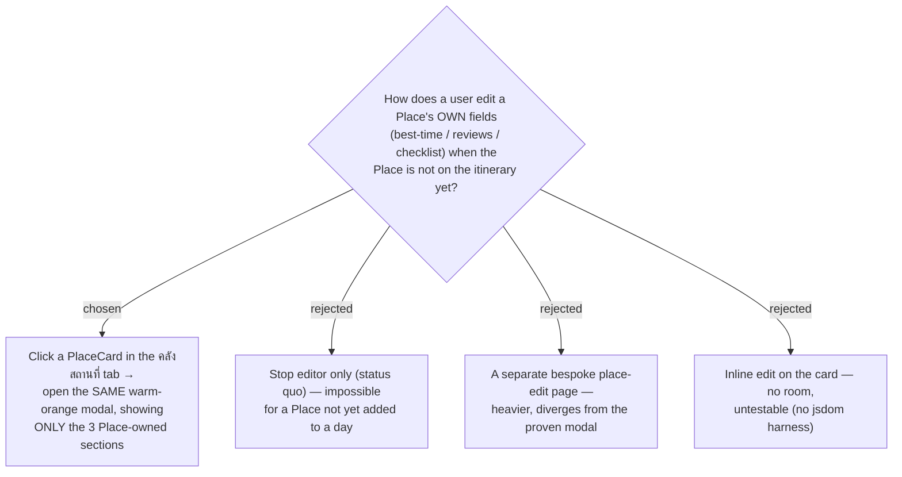

# ADR-062: Place-owned fields are editable from the คลังสถานที่ tab via a Place editor modal

**Date:** 2026-07-13
**Status:** Accepted
**Relates to:** ADR-051 (Review links edited in the Stop editor), ADR-061 (checklist Phase-1 modal-only),
ADR-063/064/065 (the cross-trip master this editor writes through). Implements the owner request
"ควรใส่ข้อมูลพวกนี้ได้ที่ คลังสถานที่ด้วย" (be able to enter this data from the Places tab too).

## Context

The three fields best-time window, **Review link** list, and **Checklist** are stored on `TripPlace` and
already have Place-scoped endpoints (`updateTripPlace`, checklist attach/detach/check). But the only edit
surface is `StopEditorDialog`, reachable from the **Itinerary** tab (a **Stop**). A Place captured into
the **คลังสถานที่** (Places) tab but not yet added to a day therefore has **no way at all** to receive
this data. `PlaceCard` is read-only today (its `onClick` is unused). `deleteTripPlace` exists but is
wired to no UI.

## Decision

**Clicking a `PlaceCard` in the คลังสถานที่ tab opens a Place editor modal that reuses the Stop editor's
warm-orange language and shows only the three Place-owned sections.**

- **Scope = best-time window + review links + checklist.** `dwell` and `travel mode` are **Stop-owned**
  (they need a Stop on the itinerary) and are excluded.
- **Header meta** shows the category chip + a **"คลังสถานที่"** crumb, in place of the Stop editor's
  "วัน N · จุดที่ M".
- **Shared sections.** The best-time, review-links, and checklist sections are extracted into shared
  components so `StopEditorDialog` and the new `PlaceEditorDialog` render identical UI — the three
  sections **stay in the Stop editor too** (single source of truth = `TripPlace`).
- **Commit model mirrors the Stop editor:** best-time + review links persist on **Save**; checklist
  attach/detach/check remain **live**.
- **Entry point** is the list `PlaceCard` (desktop list + mobile "รายการ" view). Map-pin entry is out of
  scope.
- The footer's remove action and a push-to-master action are decided in ADR-065 / ADR-064.

### Rejected

- **Stop-editor-only (status quo)** — the exact gap reported.
- **Separate bespoke page** — heavier and inconsistent with the established modal.
- **Inline card edit** — the dense card has no room and cannot be unit-tested (vitest runs in `node`,
  no jsdom — CLAUDE.md).

## Consequences

**Positive:** reuse by extracting section components; one design language; both surfaces edit the same
`TripPlace` so they can never diverge. **Negative / deferred:** the modal must be verified
**interactively** (no component test harness — CLAUDE.md). Introduces `PlaceEditorDialog` and a click
handler on `PlaceCard`.