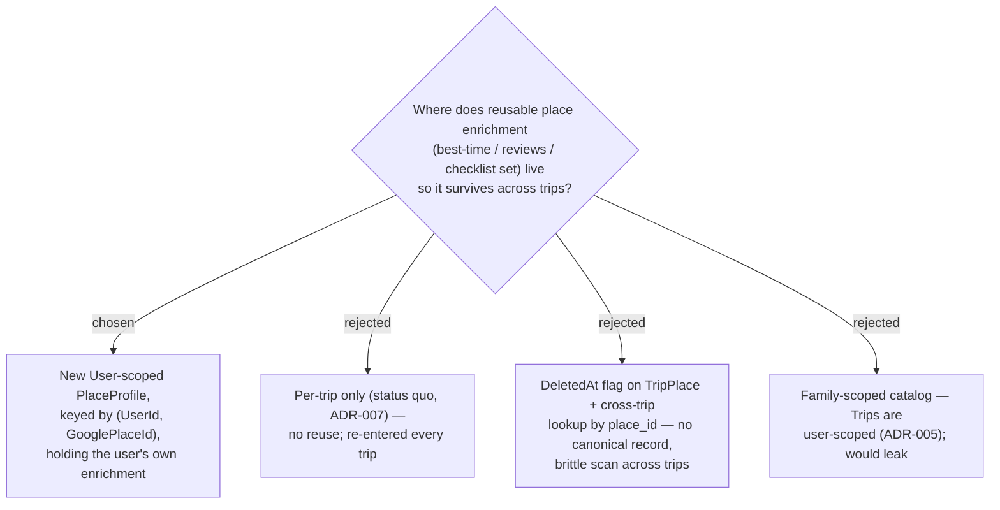

# ADR-063: A Place profile is a User-scoped, cross-trip master for place enrichment, keyed by (UserId, GooglePlaceId)

**Date:** 2026-07-13
**Status:** Accepted
**Relates to:** ADR-007 (a Place/TripPlace is a per-trip snapshot; place_id is the only Maps datum kept
long-term), ADR-058 (the User-scoped **Checklist library** whose ownership pattern this mirrors), ADR-005
(Trips are user-scoped), ADR-064/065/066 (lifecycle, delete, scope). Implements the owner request that a
place's enrichment survive across trips ("ค้นหาคราวหน้าจะได้มีข้อมูลพวกนี้").

## Context

Today `TripPlace` is a **per-trip snapshot** (ADR-007) and Capture creates an **empty** one — enrichment
must be re-entered every trip. The owner wants it remembered and re-surfaced on the **next Capture**,
across all their trips ("master data").

**ADR-007 relationship (important):** ADR-007 forbids hoarding *Google's* data (name/coords/hours stay a
cache re-fetched fresh; `place_id` is the durable anchor). The data we retain here is the **user's own**
enrichment (best-time they chose, review links they added, checklist items) — so a user-scoped store
keyed by `place_id` does **not** violate ADR-007's retention rule. It introduces a **new concept
alongside** `TripPlace`, using the same ownership pattern as the User-scoped `ChecklistItem` (ADR-058).

## Decision

**A Place profile is a User-scoped master record of the user's enrichment for one Google place.**

- **New entity `PlaceProfile`**, keyed by `UserId`, anchored to `GooglePlaceId`; **unique
  `(UserId, GooglePlaceId)`** (mirrors `TripPlace`'s filtered `(TripId, GooglePlaceId)` index). Holds
  `BestTimeStart/End`, `ReviewLinks` (same `ReviewLink` JSON value-object), and the **checklist
  item-set** via a junction to `ChecklistItem` (**no** checked state — that is per-trip, ADR-059).
- **Owned by the User** (FK → User, cascade), like `ChecklistItem`.
- **place_id-only.** Only Places anchored to a `GooglePlaceId` have a profile; Places with none behave
  exactly as today (ADR-066).
- **Distinct from `TripPlace`.** The Trip aggregate stays FK-only (no navigation graph). Lifecycle &
  sync are ADR-064; delete semantics ADR-065; Phase-1 scope ADR-066.

### Rejected

- **Per-trip only (B)** — the reported gap.
- **DeletedAt flag + cross-trip lookup (C)** — no single canonical record; the owner explicitly wanted
  "master data", and a per-trip scan is brittle and order-dependent.
- **Family-scoped (D)** — Trips are user-scoped (ADR-005); a family catalog would leak one member's
  data.

## Consequences

**Positive:** cross-trip reuse by construction; normalized and queryable; reuses the Health/Checklist
User-scoped ownership pattern. **Negative / deferred:** new table(s) + a migration applied to prod **by
hand** (CLAUDE.md); the checklist item-set needs a `PlaceProfile`↔`ChecklistItem` junction. Orphan
profiles (no current TripPlace) persist as the reuse library (ADR-065).