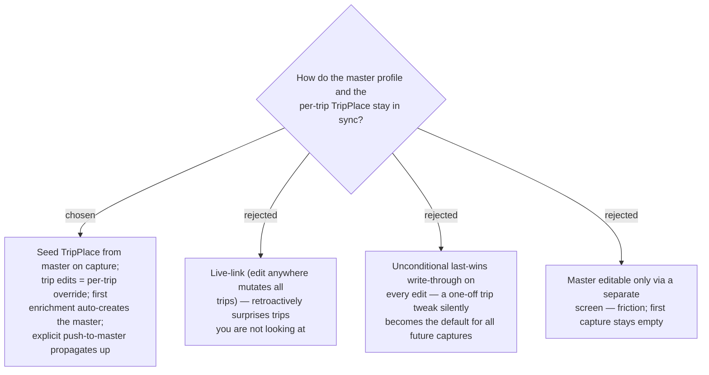

# ADR-064: Master + per-trip override — seed on capture, auto-create on first enrichment, explicit push-to-master

**Date:** 2026-07-13
**Status:** Accepted
**Relates to:** ADR-063 (the PlaceProfile master), ADR-007 (per-trip snapshot), ADR-059 (checked is
per-trip). Resolves the owner's framing "อยากให้มันเป็นแบบ master data แล้วแก้ไข detail ต่างกันได้เฉพาะทริป"
and choice "ครั้งแรกสร้าง master อัตโนมัติ + แก้ครั้งต่อ=เฉพาะทริป + ปุ่มดันขึ้น master".

## Context

The owner wants a canonical record with **per-trip divergence**, without a trip tweak **leaking** to all
future captures, yet automatic enough that the **next Capture already has the data**.

## Decision

**Copy-on-capture seeding + per-trip override + first-enrichment auto-create + explicit push-to-master.**

- **Seed-on-capture.** `AddTripPlace`, after resolving `GooglePlaceId`, looks up the user's
  `PlaceProfile`; if found, copies best-time + review links into the new `TripPlace` and creates
  `PlaceChecklistEntry` rows (`IsChecked=false`) for each profile checklist item.
- **First-enrichment auto-create.** On the editor's **Save**, if the place has **no** profile yet,
  create one as a snapshot of the current best-time + review links + attached checklist item-set. So the
  first enrichment of a place becomes its master automatically → the next Capture has the data.
- **Per-trip override.** Once a master exists, **Save writes only to the `TripPlace`** (and its checklist
  entries). Other trips' `TripPlace`s are **never** retroactively changed.
- **Push-to-master.** An explicit, opt-in action ("ดันขึ้น master") overwrites the `PlaceProfile` with
  the current `TripPlace`'s best-time + reviews + checklist item-set, so a per-trip tweak becomes the
  default **only** when the user chooses.
- **Checked state is never in the master.** It is per-trip (ADR-059) and seeds as `false`.

### Rejected

- **Live-link (B)** — mutating a saved plan you are not viewing is surprising and breaks the per-trip
  snapshot spirit (ADR-007).
- **Unconditional last-wins write-through (C)** — makes an incidental trip tweak the silent default.
- **Master-only-via-separate-screen (D)** — first capture would stay empty and the flow gains friction;
  contradicts "next capture has the data".

## Consequences

**Positive:** automatic on the common path (first enrichment) yet no accidental leakage; each trip is an
independent snapshot. **Negative / deferred:** the auto-create branch lives at the editor Save path; the
Capture path gains a profile lookup+seed; a new **push** endpoint/handler is needed. "First enrichment"
= the Save that first populates **any** of the three fields; an all-empty Save creates no master.
Concurrency backstop is the unique `(UserId, GooglePlaceId)` index; create-or-update resolves to the
existing row.