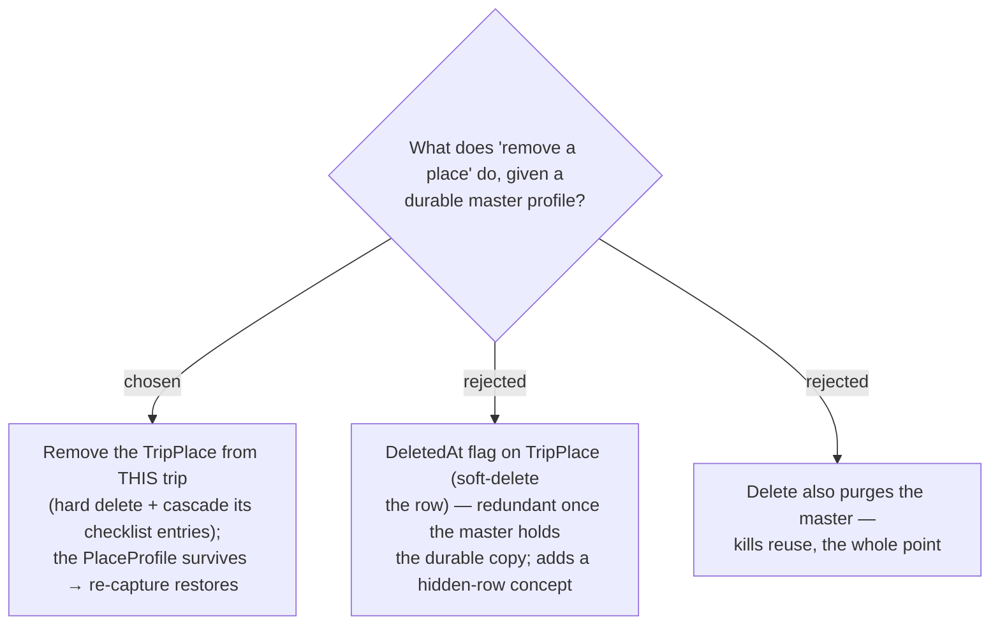

# ADR-065: Removing a place from a trip is per-trip and never touches the master (the "soft delete")

**Date:** 2026-07-13
**Status:** Accepted
**Relates to:** ADR-063 (PlaceProfile master), ADR-064 (seed/override lifecycle), ADR-059
(PlaceChecklistEntry cascades on TripPlace delete). Resolves the owner's "เอาเป็น soft delete ตอนค้นหา
คราวหน้าจะได้มีข้อมูลพวกนี้".

## Context

The owner asked for a "soft delete" so the data is there next time they search. With a durable
`PlaceProfile` (ADR-063/064), the enrichment already lives in the **master**, not the `TripPlace`. So a
plain removal of the `TripPlace` already satisfies "the data survives" — a `DeletedAt` flag on
`TripPlace` would add a hidden-row concept with no added benefit.

## Decision

**"เอาออกจากทริปนี้" removes only the `TripPlace`; the master is untouched.**

- Uses the existing (currently unwired) `deleteTripPlace` endpoint — a **hard** delete;
  `PlaceChecklistEntry` rows cascade (ADR-059). The `PlaceProfile` is **not** touched.
- **Re-capturing** the same Google place — same trip or any other — seeds from the surviving master
  (ADR-064), which is the "soft delete" experience the owner wanted.
- **No `DeletedAt` column on `TripPlace`.**
- **Purging the master itself** (removing a profile from the library) is out of Phase 1 (ADR-066).

### Rejected

- **DeletedAt on TripPlace (B)** — redundant hidden-row state once the master is the durable copy.
- **Cascade-delete the master (C)** — destroys the reuse guarantee that is the whole point.

## Consequences

**Positive:** wires the already-existing `deleteTripPlace` mutation to the editor; no new delete surface;
reuse is safe because removal is local. **Negative / deferred:** orphan masters (no current TripPlace)
persist as the reuse library — accepted, mirroring the immortal `ChecklistItem` (ADR-059); a way to
delete a profile is Phase 2 (ADR-066). The editor's remove action is labelled "เอาออกจากทริปนี้" (not
"ลบสถานที่") to reflect that only this trip's copy goes.