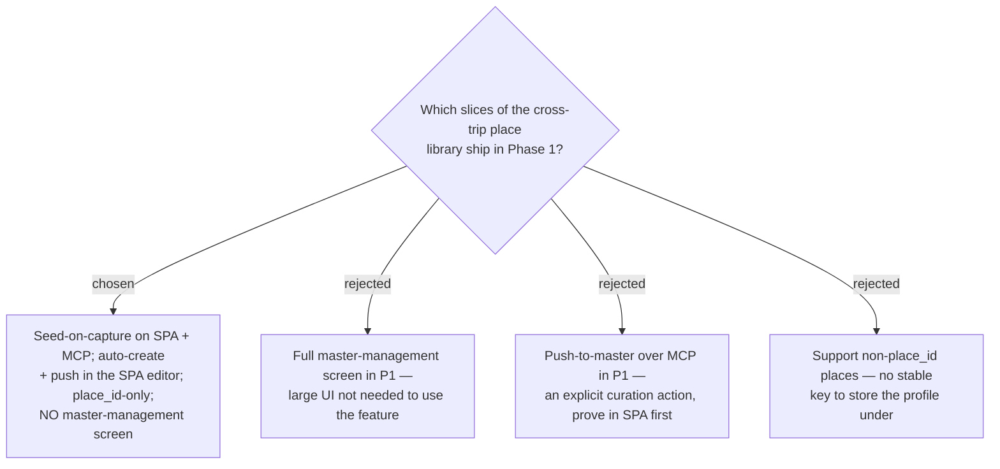

# ADR-066: Phase-1 scope — MCP seeds from the master (push deferred), no master-management screen, place_id-only

**Date:** 2026-07-13
**Status:** Accepted
**Relates to:** ADR-063/064/065 (the master + lifecycle), ADR-034/035 (Trips exposed over MCP; place
capture via resolve_place), ADR-061 (checklist library-management deferred), ADR-009 (MVP-cutting habit).

## Context

Capture happens over **both** the SPA and **MCP** (ADR-034/035). Seeding must be consistent so the same
human gets the same data on either entry path. The team habitually cuts nice-to-haves to Phase 2
(ADR-009), and ADR-061 already deferred the checklist library-management UI.

## Decision

**Phase 1 ships the reuse plumbing everywhere it must be consistent, and defers curation UI.**

- **In scope (Phase 1):** the `PlaceProfile` entity + junction + migration; **seed-on-capture on
  `AddTripPlace`** (shared by SPA *and* MCP capture); **first-enrichment auto-create + explicit
  push-to-master in the SPA editor**; the `PlaceEditorDialog` (ADR-062); wiring remove-from-trip
  (ADR-065).
- **Out of scope (Phase 2):**
  - **Master-management screen** — browse / rename / delete profiles as their own surface.
  - **push-to-master as an MCP tool** — seeding parity is the essential MCP need; push is explicit
    curation, first proven in the SPA.
  - **Non-`place_id` places** — no stable key; they get no profile and behave exactly as today.

### Rejected

- **Master-management screen in P1 (B)** — implicit create + push make it usable without a management
  screen (same reasoning as ADR-061).
- **push over MCP in P1 (C)** — capture-seed parity suffices; push is a deliberate action.
- **Non-place_id library (D)** — nothing stable to key on.

## Consequences

**Positive:** the smallest slice that delivers cross-trip reuse consistently; MCP gains seeding for free
by sharing `AddTripPlace`. **Negative / deferred:** orphan profiles accumulate with no P1 delete UI
(accepted — they *are* the reuse library); MCP callers cannot push to the master yet. The migration must
be applied to prod **by hand** (CLAUDE.md).