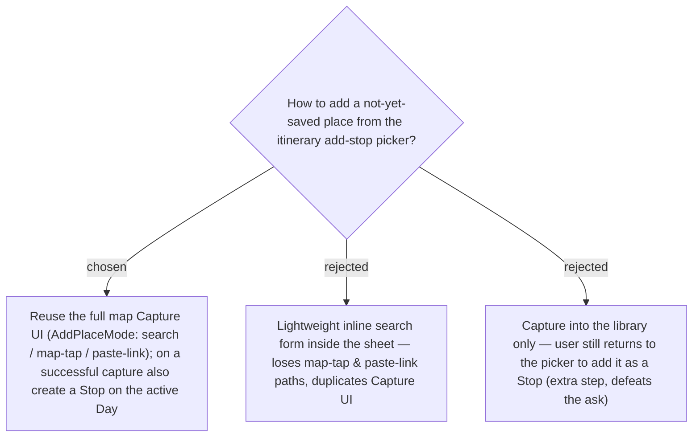

# Add-new-place from the itinerary add-stop picker reuses the full map Capture and auto-schedules a Stop

Issue #36 asks to add a brand-new **Place** directly from the itinerary's "เลือกจุดแวะ"
(add-stop) picker. We reuse the existing **Capture** experience (`AddPlaceMode`) in full —
all three entry paths (live search, map-tap, paste-link) — rather than building a second,
thinner capture form; and on a successful capture we immediately add the new Place as a
**Stop** on the **Day** the user was viewing, because the user's intent (they tapped "add
stop") is a Stop, not merely a library entry. See [[068]] (single-shot), [[070]] (rendering),
[[071]] (frontend-only chaining).
