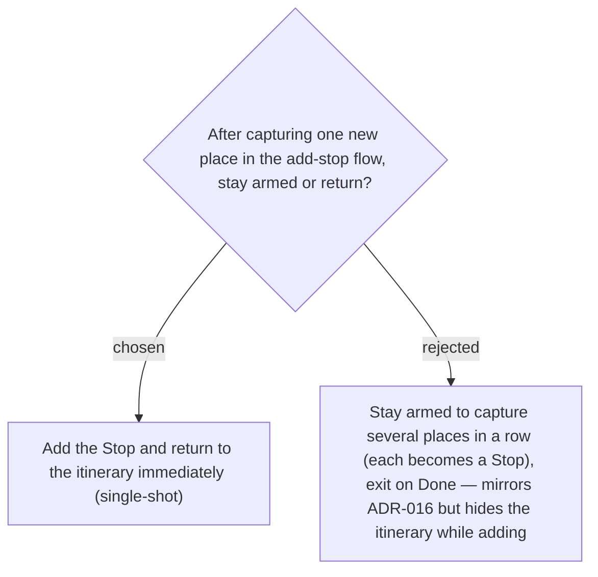

# Itinerary Capture is single-shot — one place → one Stop → return to the itinerary

The Places-tab **Capture** stays armed after each add for bulk library entry (ADR-016). The
itinerary add-stop flow deliberately diverges: it captures exactly one Place, schedules it as
a **Stop**, and bounces straight back to the itinerary so the user immediately sees the new
Stop in context (tight feedback loop). To add another, they tap "+ เพิ่มจุดแวะ" again. This
divergence from ADR-016 is intentional — the two flows have different goals (bulk library fill
vs. add this one stop). See [[067]].
