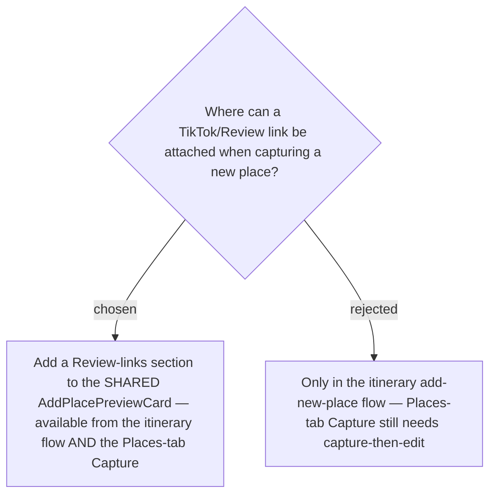

# Review links are entered at Capture, via the shared preview card

`addTripPlace` already accepts `reviewLinks`; today the Capture card hard-codes `[]`. We add a
**Review link** section (reusing `ReviewLinksSection` + the `reviewLinks` lib) to the *shared*
`AddPlacePreviewCard`, so any **Capture** — itinerary or Places tab — can attach review links
in one step, closing the existing "capture, then re-open the Stop/Place editor to add the link"
gap everywhere rather than only on the new path. The links belong to the **Place** (ADR-049),
never the **Stop**. See [[067]], [[project_trip_review_link]].
