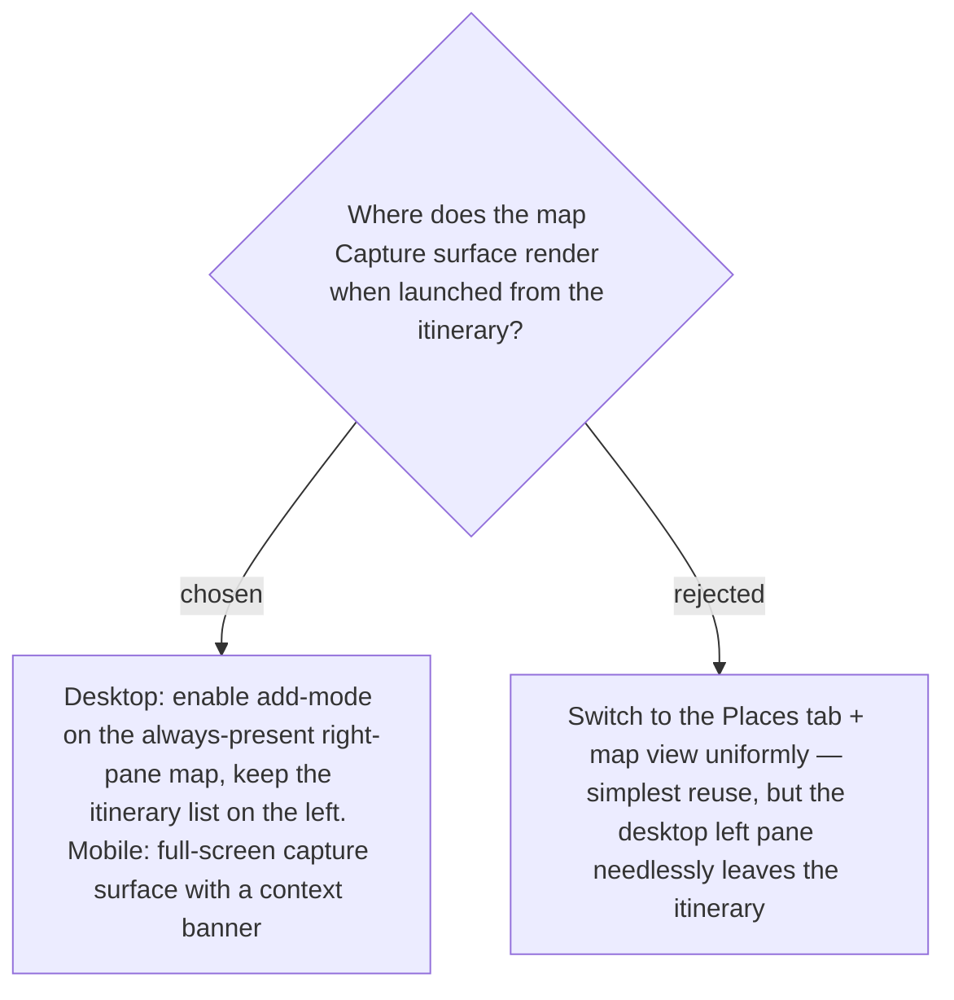

# Itinerary-origin Capture keeps the itinerary in view — desktop right-pane add-mode; mobile full-screen

On desktop the map is always on the right, so entering **Capture** there keeps the itinerary
list visible on the left — the new **Stop** appears in that list the instant it is added. On
mobile there is no room for both, so Capture takes a full-screen surface. Both breakpoints
carry a context banner ("เพิ่มสถานที่ใหม่เป็นจุดแวะ · <Day>") whose back affordance cancels
back to the itinerary, so the user always knows the captured Place will become a Stop on that
Day. See [[067]], mock `docs/mocks/trip-add-new-place-from-itinerary-mock.html`.
