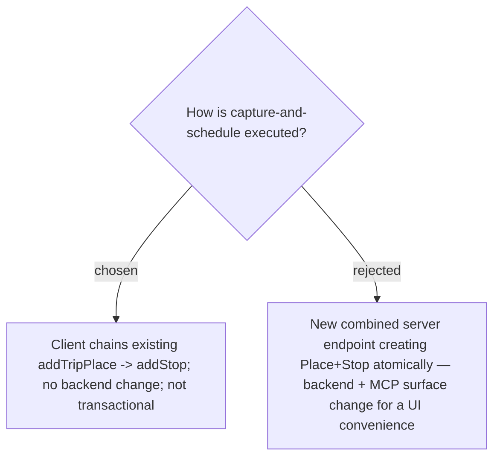

# Frontend-only — chain addTripPlace + addStop client-side, no new endpoint, non-atomic

Both `addTripPlace` (returns the created `TripPlaceDto` with its `id`, and already accepts
`reviewLinks`) and `addStop` exist and each invalidates the `TripItinerary` cache, so the
feature is a pure **frontend** composition — no controller, use-case, EF, or MCP change. The
trade-off is non-atomicity: if `addStop` fails after `addTripPlace` succeeds, the **Place** is
captured into the library but not scheduled as a **Stop**; the UI surfaces the error and the
Place is already listed in the picker for a retry. Chosen over a new atomic endpoint because
the recoverable failure mode does not justify widening the backend/MCP contract for a UI
shortcut. See [[067]], [[069]].
