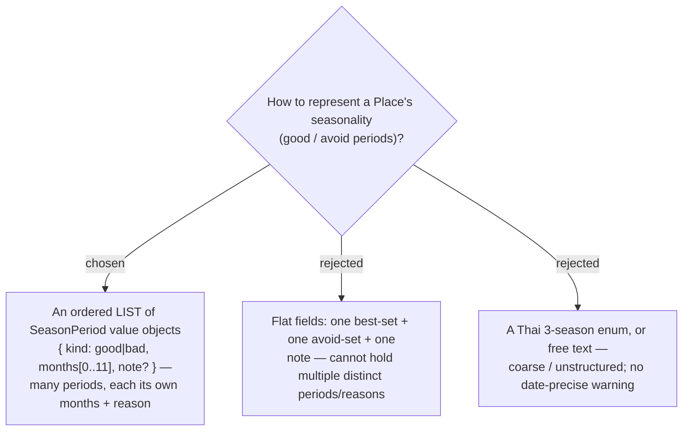

# ADR-072: Season is a per-Place LIST of SeasonPeriod value objects {kind, months[], note}, resolved avoid-wins — not flat fields

**Date:** 2026-07-17
**Status:** Accepted (revised after the owner's interactive mock confirmed a multi-record model)
**Relates to:** issue #19; ADR-050/051 (Review links — the per-Place JSON value-object **list** pattern this mirrors); ADR-076 (the off-season warning that consumes it); ADR-054/056 (the projected day date the warning tests against). Distinct from every existing "best time" (time-of-day `TimeOnly`).

## Context

Issue #19 asks a Place to remember when to go and when to avoid. The owner's confirmed mock showed a place needs **multiple distinct periods, each with its own months AND its own reason** — e.g. avoid มิ.ย.–ต.ค. "น้ำท่วมหน้าฝน" **and** avoid ธ.ค. "คนเยอะปีใหม่" **and** go พ.ย.–ก.พ. "อากาศเย็น น้ำใส". A single best-set + single avoid-set + one note cannot express that. Calendar **months** (0..11), not a season enum, map 1:1 to a Stop's scheduled month for a warning. The list-of-value-objects shape is exactly the Review-links model (ADR-050/051).

## Decision

**A Place's season is an ordered LIST of `SeasonPeriod` value objects.**

- `SeasonPeriod` = `{ kind: 'good' | 'bad', months: int[] (0..11), note?: string }`.
- A **Place** (`TripPlace`) and its **PlaceProfile** master each hold this list, persisted as **JSON** — same EF pattern as `ReviewLinks` (a `ValueComparer` for the collection, a JSON column).
- **Resolution:** `monthStatus(periods, month)` returns the matching period; **`bad` (avoid) wins over `good`** when a month is in both; else `none`. This and `rangeLabel(months)` (compress `[5..9]` → "มิ.ย.–ต.ค.", wrap-aware for `[10,11,0,1]`) live as **pure shared logic in `frontend/src/pages/trips/lib/season.ts`** (+ `season.test.ts`).
- **Optional** — a Place may have zero periods.

### Rejected

- **Flat single sets (B)** — cannot hold multiple periods, each with its own reason (the owner's explicit requirement "หลาย record … ต่อ 1 master").
- **Season enum / free text (C)** — coarse or unstructured; neither gives a date-precise, per-reason warning.

## Consequences

**Positive:** arbitrary number of good/avoid periods per place, each with its own reason; the JSON-list shape reuses shipped Review-links plumbing; `monthStatus`/`rangeLabel` are pure and unit-tested. **Negative / deferred:** a JSON list column on **two** entities (mirror the ReviewLinks EF config incl. `ValueComparer`); the AI/MCP write replaces the whole list (ADR-074); overlapping avoid periods on one month resolve to the **first** matching by list order (spec detail).
