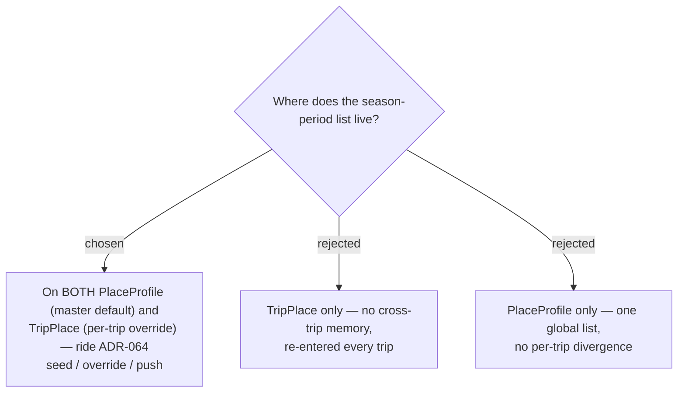

# ADR-073: The season-period list lives on both PlaceProfile (master) and TripPlace (per-trip override), riding the seed / override / push lifecycle

**Date:** 2026-07-17
**Status:** Accepted
**Relates to:** ADR-072 (the `SeasonPeriod` list this stores); ADR-063 (PlaceProfile is the user-scoped master); ADR-064 (the seed-on-capture / per-trip-override / first-enrichment-auto-create / push-to-master lifecycle reused wholesale); ADR-066 (place_id-only — no profile for Places without a `GooglePlaceId`).

## Context

A place's seasonality is inherently **stable across trips** — *3000 โบก* floods in the rainy season regardless of which trip visits — so it is the "master data" #37's `PlaceProfile` machinery was built for. Reusing that machinery makes season behave identically to the best-time window / review links / checklist set the owner already knows.

## Decision

**Add a `SeasonPeriods` JSON value-list (the ADR-072 shape) to BOTH `PlaceProfile` (master default) and `TripPlace` (per-trip override), governed by the ADR-064 lifecycle:**

- **Seed-on-capture** — `AddTripPlace` copies the profile's `SeasonPeriods` into the new `TripPlace` (extend `PlaceProfileSync`).
- **Per-trip override** — editor **Save** writes the list only to the `TripPlace`; other trips are never retroactively changed.
- **Push-to-master** — the existing "ดันขึ้น master" action also overwrites the profile's `SeasonPeriods`.
- **First-enrichment auto-create — season counts** — a non-empty `SeasonPeriods` list joins best-time / reviews / checklist as an **enrichment** that mints the master on first Save, so a place enriched with *only* a season still gets remembered.
- **place_id-only (ADR-066)** — a Place with no `GooglePlaceId` carries its season list on the `TripPlace` only; no profile.

### Rejected

- **TripPlace only (B)** — no cross-trip memory; contradicts #19's "remember next time".
- **PlaceProfile only (C)** — one global list; you could never risk the rainy season for one trip only.

## Consequences

**Positive:** zero new sync mechanism — season inherits a shipped, scrutinized lifecycle. **Negative / deferred:** the copy point (`PlaceProfileSync`), the push handler, and the "first-enrichment" predicate all extend to include `SeasonPeriods`; **every `TripPlaceDto` construction site** (handlers, MCP, test contexts, fixtures) must add it (scan all callers). **No new `DbSet`** — a JSON column on existing entities satisfies the three-DbContext rule automatically; the new column still needs a migration applied to prod by hand.
