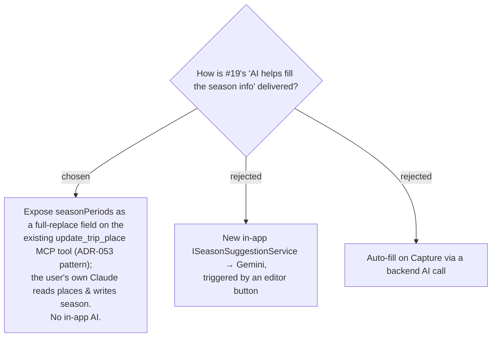

# ADR-074: AI-assisted season fill is delivered by exposing the season list as a full-replace field on update_trip_place over MCP — not an in-app AI service

**Date:** 2026-07-17
**Status:** Accepted
**Relates to:** issue #19 ("ให้เอไอช่วยเติมข้อมูล"); ADR-034/035 (Trips exposed over MCP); ADR-053 (reviewLinks added to `update_trip_place` as a full-replace list + exposed over MCP — the identical pattern this reuses); ADR-072/073 (the season list shape and ownership the tool writes).

## Context

The only AI wired into this backend is the **family-scoped, conversational** `GeminiChatService` (`IAiChatService`) for meal planning — the wrong shape for structured place enrichment. A bespoke service + button would add a service, options binding, a config-absent fallback, and per-call token cost. The owner declined that: **"แค่ให้ ai เรียกใช้ as tool, so I will [tell] claude myself to fill information."** — the AI is an **MCP client the owner drives**, not a feature inside MenuNest. Review-links already ride `update_trip_place` as a full-replace list (ADR-053); the season list fits that mould exactly.

## Decision

**The "AI fill" is achieved entirely by exposing the season list over MCP; MenuNest itself calls no AI.**

- Add `seasonPeriods` (the ADR-072 `SeasonPeriod[]` list) to `update_trip_place` (HTTP PUT body + `UpdateTripPlaceCommand` + domain `TripPlace.UpdateDetails` + the MCP tool signature) as a **FULL-REPLACE** field — exactly as ADR-053 did for `reviewLinks`.
- **Read-side is automatic** via `TripPlaceDto` (`list_trip_places`, itinerary places, `add_trip_place`), so the agent sees which places lack a season.
- **No** in-app AI service, Gemini call, editor "suggest" button, or auto-fill-on-capture.
- **Full-replace discipline** carries over: the owner's Claude must round-trip the other place fields or clear them — the tool's documented contract.
- **Master auto-create still applies** (ADR-064): an MCP season write to a place with no profile yet mints the master, so it is remembered on the next Capture.

### Rejected

- **Bespoke in-app service (B)** — the scope + token cost the owner explicitly declined.
- **Auto-fill on Capture (C)** — silent, costly on every capture, wrong without review.

## Consequences

**Positive:** near-zero new backend surface for the "AI" part — the season list is just one more full-replace field on a tool that already exists; the owner's existing Claude+MCP workflow does the enrichment; blast radius is the same bounded set as ADR-053 (two command-construction sites + the one SPA call site + fixtures). **Negative / deferred:** updating the **master** season of a place that *already has a profile* needs push-to-master (ADR-075 exposes it over MCP); the owner drives the fill turn-by-turn (no in-app bulk automation), the intended trade.
