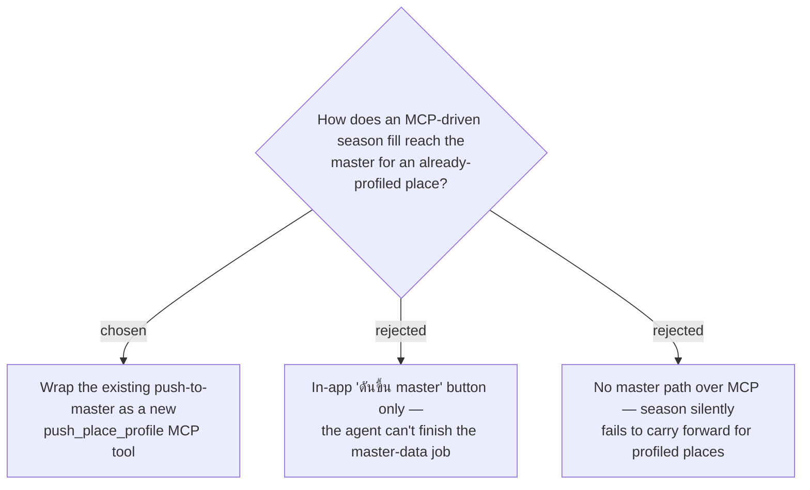

# ADR-075: Expose push-to-master over MCP so an agent can persist season (and all enrichment) to the PlaceProfile master

**Date:** 2026-07-17
**Status:** Accepted
**Relates to:** ADR-074 (season is a per-trip full-replace field on `update_trip_place` over MCP); ADR-064 (master auto-creates only when no profile exists; otherwise push is the only way up); ADR-063 (PlaceProfile master). The push HTTP path (`POST /api/trips/{id}/places/{placeId}/push-to-profile`, `PushPlaceProfileHandler`) already exists for the SPA "ดันขึ้น master" button but is **not** among the 23 existing MCP tools.

## Context

ADR-074 writes season per-trip via `update_trip_place`. ADR-064 auto-creates the master **only when a place has no profile yet**; for a place that already has a profile, a per-trip season write is an override and the **master stays season-less**, so a future trip re-capturing that place seeds no season. The owner wants their Claude to build reliable "master data" — so the agent needs a way to persist per-trip enrichment up to the master, exactly what the in-app push button does.

## Decision

**Add a `push_place_profile` MCP tool that wraps the existing push handler.**

- Signature: `push_place_profile(tripId, placeId)` → the updated `TripPlaceDto` (or profile), delegating to the existing `PushPlaceProfile` use case / endpoint. **No new HTTP endpoint, no new domain logic.**
- Semantics are unchanged from ADR-064: push is a **FULL overwrite** of the `PlaceProfile` from the current `TripPlace`'s enrichment — best-time, review links, checklist item-set, **and now the season fields**. Season needs no special-casing; it rides the same push.
- Tool description must state the full-overwrite semantics so the agent finishes shaping the `TripPlace` (via `update_trip_place`) **before** pushing.

### Rejected

- **In-app push only (B)** — the agent could write per-trip but never complete the master-data fill for already-profiled places; the owner would have to finish each by hand.
- **No master path over MCP (C)** — season would silently fail to carry forward for the (common, over time) case of a place profiled before it had a season.

## Consequences

**Positive:** the read → per-trip write → push-to-master loop is fully drivable over MCP; one small bounded tool; season is automatically included because push already copies all enrichment. **Negative:** push is destructive to the master (full overwrite, ADR-064) — an agent that pushes a half-filled `TripPlace` clobbers other master enrichment; mitigated by the tool description and by the owner driving it deliberately, turn by turn.
