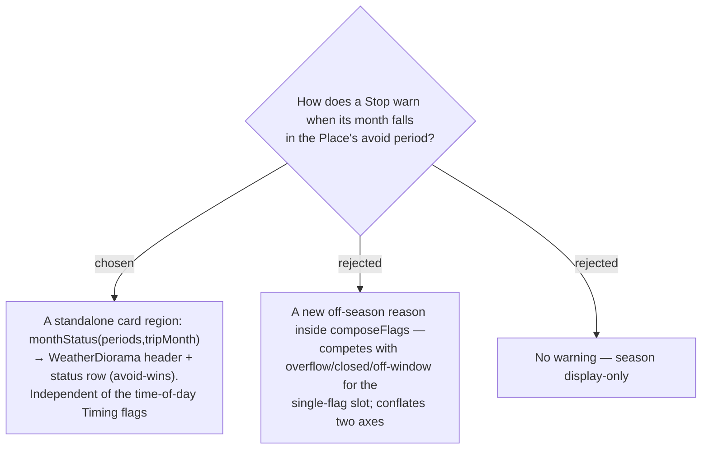

# ADR-076: The off-season warning is a standalone stop-card region (weather diorama + status row) via monthStatus — not a composeFlags Timing-flag reason

**Date:** 2026-07-17
**Status:** Accepted (revised after the owner's mock — the warning is a card region, not a timing-flag dot)
**Relates to:** ADR-072 (`monthStatus`, avoid-wins); ADR-078 (the `WeatherDiorama` visual); ADR-079 (illustrative, not live weather); ADR-019/020/021 (the time-of-day **Timing flag** system this deliberately stays OUT of); ADR-054/056 (the projected day date the warning tests).

## Context

Timing flags (`overflow` / `closed` / `off-window`) are **time-of-day**, and `composeFlags` shows the single most-severe **one per Stop**. The season warning is a different axis (calendar **month**), and the owner's design renders it as a rich card element — an animated **weather diorama** header plus a status row — not a small flag dot. Forcing it into `composeFlags` would make it fight the time-of-day flags for the one slot and conflate two unrelated concerns.

## Decision

**The off-season warning is its own stop-card region, computed from the season list — separate from the Timing-flag system.**

- The card computes `const st = monthStatus(place.seasonPeriods, tripMonth)` where `tripMonth` is the **itinerary-projected** day month (respecting current-time-start date float, ADR-054/056), never the raw persisted date.
- It renders `<WeatherDiorama kind={st.kind} />` as the card header, then a status row: for `bad`, an icon + "เดือนนี้ควรเลี่ยง · `<the matched period's note>`" + fix "ย้ายทริปไปเดือนอื่น"; a calm/positive treatment for `good`; neutral for `none`. Card `border-top` uses the status accent.
- **`monthStatus` is avoid-wins** (ADR-072): a `bad` match beats a `good` match on the same month; the matched period supplies the note.
- **The `FlagReason` union, `composeFlags`, and their priority are untouched** — a Stop can show BOTH its time-of-day Timing flag AND its season diorama; they never compete.
- The resolution is **pure** (`monthStatus` in `lib/season.ts`) → unit-tested via `season.test.ts`.

### Rejected

- **A composeFlags reason (B)** — would compete for the single-flag slot and mix the month axis into a time-of-day system.
- **No warning (C)** — wastes the month precision (ADR-072).

## Consequences

**Positive:** no change to the Timing-flag core; season and timing warnings coexist; the trigger is pure and unit-testable. **Negative / deferred:** a new `WeatherDiorama` component (ADR-078) + status row on the card; the itinerary day's projected month must be threaded down to `ItineraryStopCard` (it does not receive it today).
