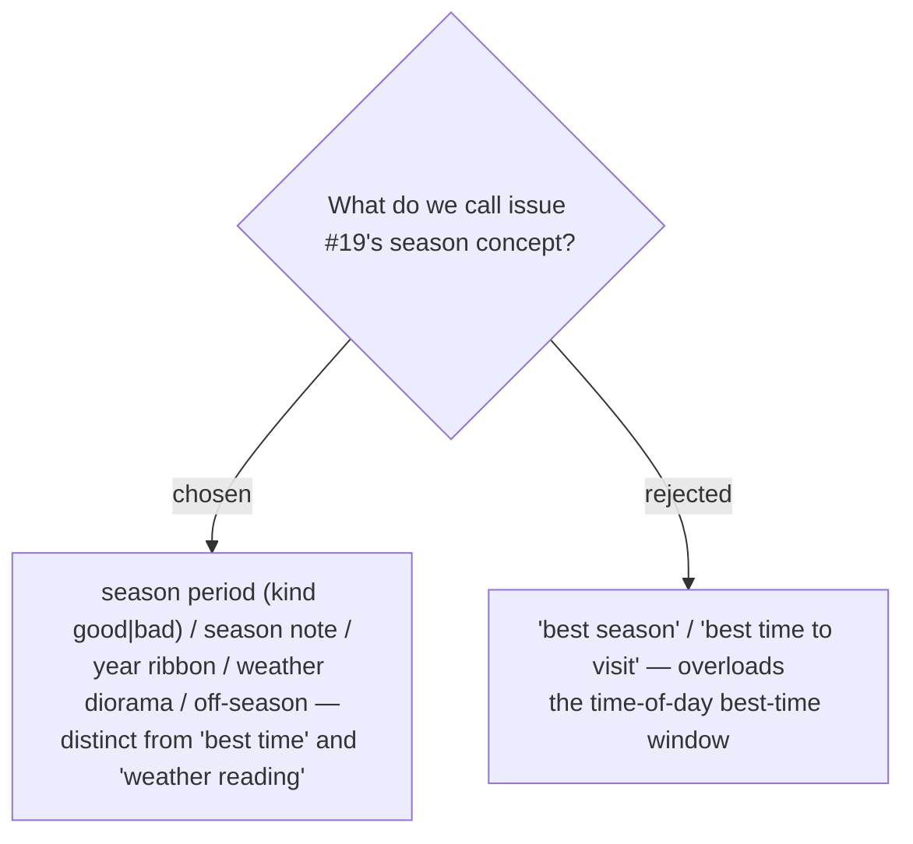

# ADR-077: Season vocabulary — "season period" (kind good|bad) / "season note" / "year ribbon" / "weather diorama" / "off-season", never "best time"

**Date:** 2026-07-17
**Status:** Accepted (revised for the multi-record + diorama model)
**Relates to:** ADR-072 (the period list); ADR-076 (the off-season warning); ADR-078 (the diorama); ADR-080 (the ribbon); the existing **best-time window** (time-of-day) and **Weather reading** (live forecast) whose names this stays clear of.

## Context

"Best time" already names the **time-of-day** window (feeding **off-window**), and **Weather reading** names the **live forecast** (issue #10). #19's concept must avoid overloading either, so it gets its own vocabulary.

## Decision

Canonical terms (added to `CONTEXT.md`):

- **Season period** — one entry `{ kind, months, note? }` in a Place's season list.
- **kind** — `good` | `bad` in code; **ควรไป** / **ควรเลี่ยง** in the UI.
- **Season note** — the per-period free-text reason.
- **Year ribbon** — the 12-month overview + month-picker in the editor (ADR-080).
- **Weather diorama** — the animated canvas that signals the resolved season on a Stop card (ADR-078); **not** a **Weather reading** (the live forecast).
- **Off-season** — the state of a Stop whose month resolves to a `bad` period (`monthStatus`), shown via the diorama + status row (ADR-076).

**"Best time" is reserved for the time-of-day window** and is never used for season.

### Rejected

- **"best season" / "best time to visit" (B)** — collides with the time-of-day best-time window.

## Consequences

**Positive:** unambiguous names across code, UI, and glossary; "weather diorama" vs "weather reading" keeps the illustrative-season visual distinct from the live forecast (ADR-079). **Negative:** none — naming hygiene that prevents two real collisions.
