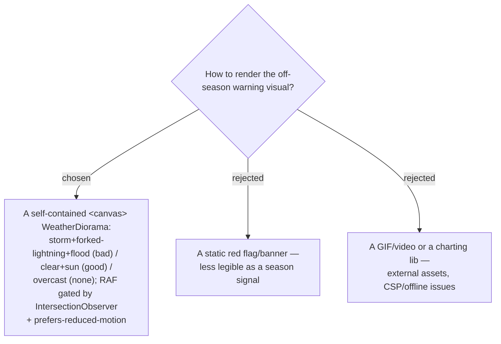

# ADR-078: The off-season warning is rendered as an illustrative animated WeatherDiorama (canvas), perf/a11y-gated

**Date:** 2026-07-17
**Status:** Accepted (from the owner's confirmed mock)
**Relates to:** ADR-076 (the card region that hosts it); ADR-072 (`monthStatus` supplies its `kind`); ADR-079 (illustrative, not live weather).

## Context

The owner's confirmed mock uses an **animated weather diorama** as the season signal — it reads at a glance (a flooded, storm-lit สามพันโบก vs a clear sunny one) far better than a text flag. It is a self-contained canvas animation (no libraries), keyed by the `monthStatus` kind.

## Decision

**`WeatherDiorama.tsx` — a `ref` + `effect` canvas engine keyed by `kind: 'good' | 'bad' | 'none'`.**

- Scene table per kind (from the handoff): `bad` — water high, rain, forked lightning + flash, ripple rings, storm sky; `good` — low calm water, sun-glow, occasional ripple, clear sky; `none` — light drizzle, overcast, no lightning. Rocks = a quadratic-curve hump path drawn dark then covered by semi-transparent water so they read as submerged in `bad`.
- **Perf:** gate the `requestAnimationFrame` loop with an `IntersectionObserver` — pause when the card is off-screen.
- **A11y:** honour `prefers-reduced-motion` — render one static frame instead of looping.
- **Source:** port the engine from the owner's mock (`Place Season Redesign.dc.html`) when provided; the file was **not on disk at design time**, so the fallback is to reconstruct it from the handoff's scene table.

### Rejected

- **Static banner (B)** — the earlier mock's approach; less legible as a season signal.
- **GIF/video or charting lib (C)** — external assets break the offline/PWA story and add weight; a bespoke canvas is self-contained.

## Consequences

**Positive:** an instantly legible, dependency-free season signal. **Negative:** a canvas animation must be perf-gated and reduced-motion-safe or it wastes battery/CPU on long itineraries; the verbatim engine depends on a mock file that must be supplied (else reconstructed).
