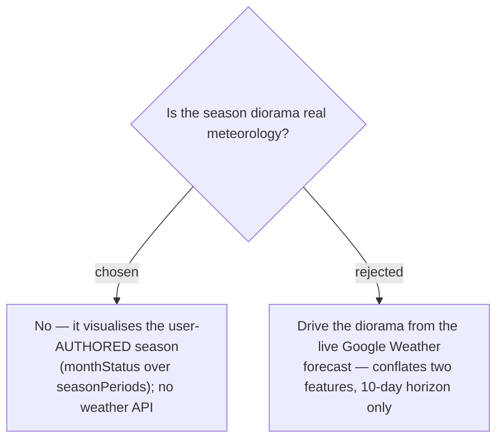

# ADR-079: The weather diorama is illustrative (authored season), NOT the live per-day weather feature

**Date:** 2026-07-17
**Status:** Accepted
**Relates to:** ADR-078 (the diorama); ADR-072 (`monthStatus`); ADR-028..033 + ADR-029 (the existing live per-Stop **Weather reading** feature, issue #10). An explicit boundary (a deliberate "no").

## Context

MenuNest already has a live per-Stop **Weather reading** (issue #10, ADR-028..033: Google Weather API, Now / On-arrival, a 10-day forecast horizon, ephemeral — never persisted). The season diorama *looks* weather-like but represents the **authored season** — the periods the owner or their Claude set — which is a property of the place across the whole calendar, independent of any specific date's forecast.

## Decision

**The diorama's `kind` comes ONLY from `monthStatus(seasonPeriods, tripMonth)` — never from a weather API.**

- The two features stay separate: **`WeatherChip`** (live forecast, ADR-029) and **`WeatherDiorama`** (authored-season signal, ADR-078) share no data path.
- The diorama is correct for **any** trip month — including far-future or past dates that fall outside the forecast horizon, where the live forecast shows **No weather data** (ADR-031).

### Rejected

- **Driving it from the live forecast (B)** — conflates the authored season with a date's actual weather, only works within the 10-day horizon, and adds API cost to a purely illustrative element.

## Consequences

**Positive:** no new API cost; the season visual is always available regardless of date; a clean conceptual split between "what season is this place" and "what's the weather that day". **Negative:** two superficially similar weather visuals coexist on the Trips surface — the glossary must keep **Weather reading** and **Weather diorama** distinct so neither is mistaken for the other.
