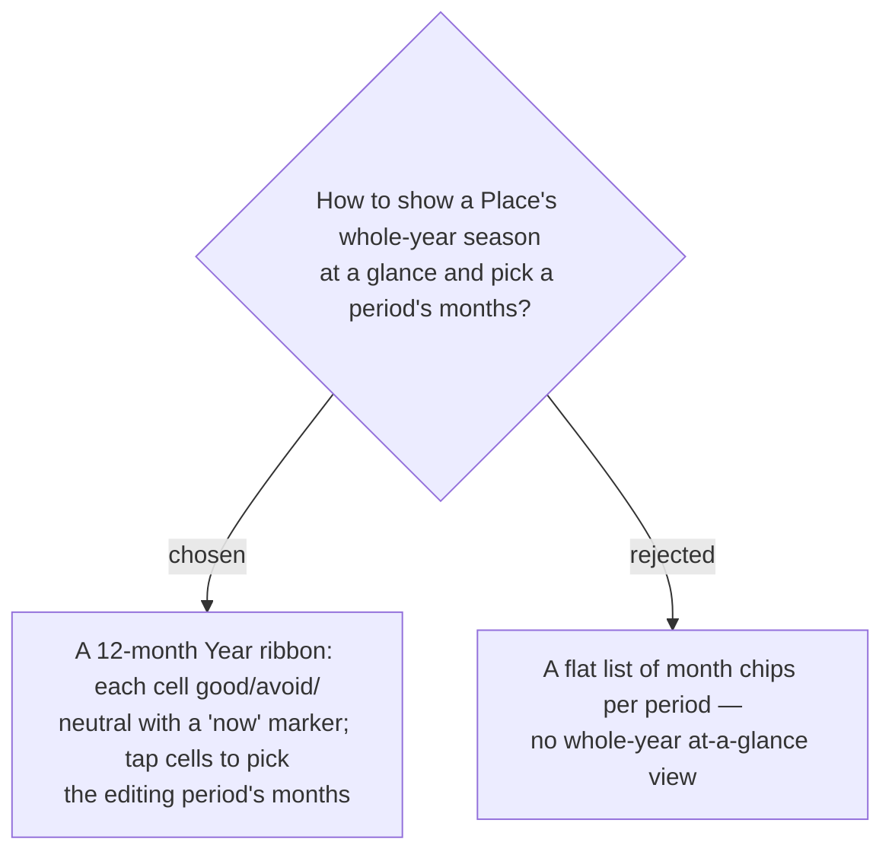

# ADR-080: The season editor uses a 12-month Year ribbon (overview + month-picker), not a flat chip list

**Date:** 2026-07-17
**Status:** Accepted (from the owner's confirmed mock)
**Relates to:** ADR-072 (the `SeasonPeriod` list it edits); the `BestTimeBar` / `ReviewLinksSection` / `ChecklistSection` editor sub-sections it sits beside.

## Context

With multiple periods per place (ADR-072), a per-period chip list shows no coherent whole-year picture and is clumsy to edit. The owner's mock uses a single **12-cell year ribbon** — good (green) / avoid (red) / neutral — with a "this month" marker, which doubles as the month-picker while editing a period.

## Decision

**`PlaceSeasonEditor.tsx` is built around a Year ribbon.**

- **Ribbon:** 12 month cells; fill from the resolved `monthStatus` per month (good / bad / neutral tokens); a "now" cell gets an ink ring; while editing, draft-selected months get an accent ring.
- **Saved-period rows** below the ribbon: kind pill + `rangeLabel(months)` + note + delete.
- **Inline editor:** a good/avoid toggle, month selection **by tapping ribbon cells**, a note input, save/cancel.
- Slots into the place/stop editor (`StopEditorDialog` / `PlaceEditorDialog`) beside `BestTimeBar`, `ReviewLinksSection`, `ChecklistSection`.

### Rejected

- **Flat month-chip list (B)** — no at-a-glance whole-year view; awkward with several overlapping periods.

## Consequences

**Positive:** the ribbon is both the overview and the picker — one control, whole-year legibility. **Negative:** a richer stateful editor component (draft period state) than a plain field; the ribbon's month-status colouring must reuse the same `monthStatus` as the card so editor and itinerary agree.
