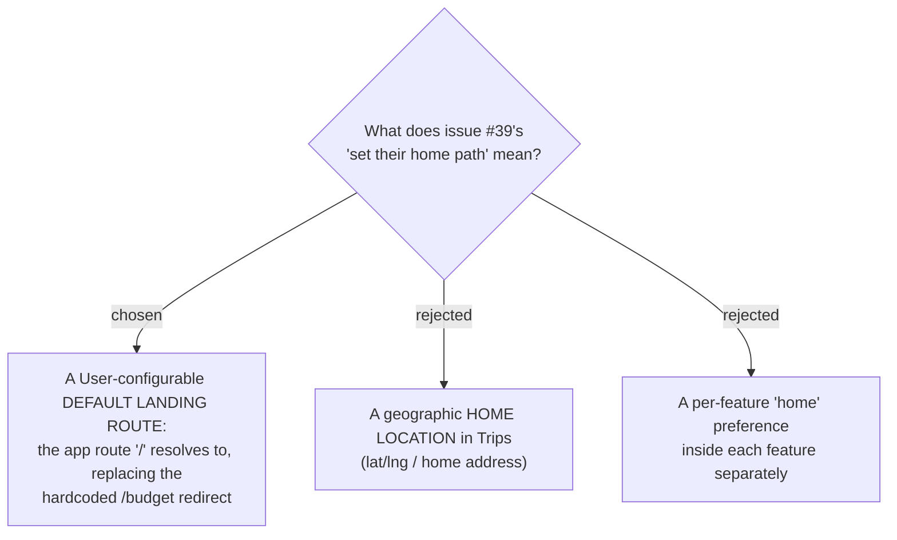

# ADR-081: "Set home page" is a User-configurable default landing route, not a geographic home

**Date:** 2026-07-17
**Status:** Accepted (owner confirmed the interpretation)
**Relates to:** issue #39; the hardcoded `/` → `/budget` redirect in `frontend/src/router.tsx`; ADR-005 (Trip is user-scoped, not family-gated).

## Context

Issue #39 ("Add Set home path functionality") reads: *"Let user can set their home path when they like /trip or /promodoro themself."* The wording is ambiguous — "home path" could be a landing page, a geographic home, or a per-feature default.

Two facts from the code disambiguate it:

- The app's landing page is **hardcoded**: `frontend/src/router.tsx` redirects `/` → `<Navigate to="/budget" replace />` (comment: "Budget is the default landing"). There is no per-user override.
- The issue's own examples — **`/trips` and `/pomodoro`** (the issue's "/trip" / "/promodoro" are loose spellings of the real routes) — are both **route paths**, and Pomodoro is a pure timer with no geography while Trips has **no** home-location concept. A meaning that spans both features therefore cannot be geographic.

So "home path" = the **route the app opens to**, chosen by the User.

## Decision

**Issue #39 delivers a per-User setting that chooses which existing app route the app lands on by default**, replacing the hardcoded `/` → `/budget` redirect. The stored value is a **route path** (e.g. `/pomodoro`), and `/` resolves to that route instead of a fixed one.

- **In scope:** a User picks their **Home page** from the app's existing top-level routes; `/` (and, by inheritance, the brand-logo link and the catch-all) lands there.
- **Out of scope (rejected):**
  - **Geographic home location (B)** — no lat/lng/home-address field. Trips deliberately has no persisted origin (ADR-011/ADR-027 keep origin ephemeral), and Pomodoro is non-geographic; a location meaning is incoherent across the two example features.
  - **Per-feature home (C)** — a separate "home tab" inside each feature. Heavier, and not what "the page the app opens to" implies.

## Consequences

**Positive:** small, well-bounded feature; it generalises the existing single hardcoded redirect into a per-User choice over routes that already exist. **Negative:** introduces the app's **first per-User preference** concept (storage approach decided in a follow-up ADR), and forces a decision about what happens when the chosen route is currently inaccessible to that User (e.g. a family-gated route for a User with no Family) — handled in a follow-up ADR.
