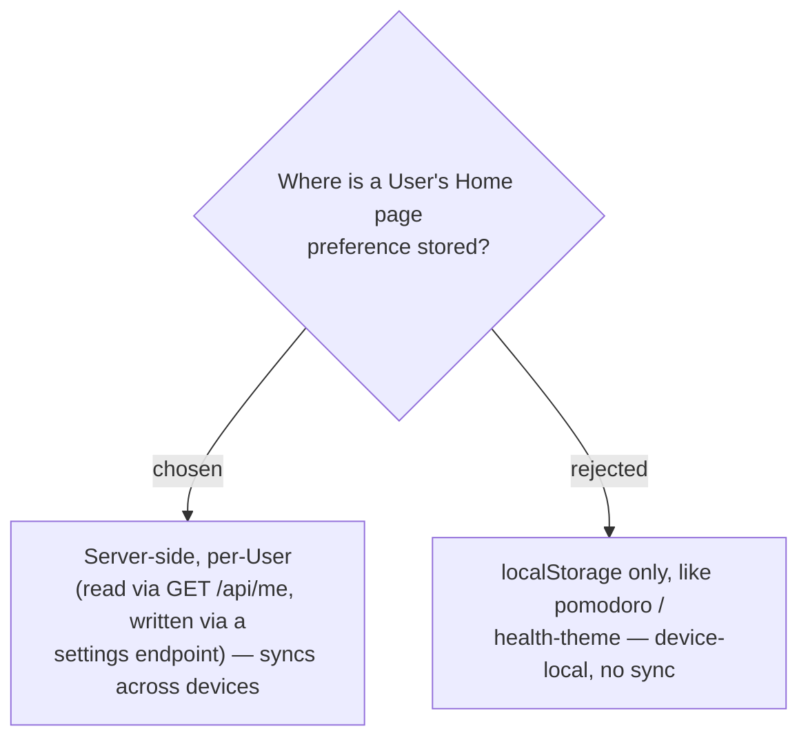

# ADR-082: The Home page preference is persisted server-side (per-User), not device-local

**Date:** 2026-07-17
**Status:** Accepted (owner chose cross-device sync over the localStorage precedent)
**Relates to:** ADR-081 (what "Home page" is); ADR-083 (how it is modelled); the existing localStorage-only prefs (`pomodoro`, `health-theme`).

## Context

Every existing per-user preference in MenuNest is **localStorage-only**: Pomodoro settings (`menunest:pomodoro:v1`) and the Health theme / period-tracking flags. That pattern is device-local — a preference set on a phone does not follow the user to their laptop. `HealthSettingsPage.tsx` even notes server persistence is "on the Phase 2 list."

The **Home page** is the page a User lands on every time they open the app; the owner wants it to **follow the user across devices**, so the localStorage precedent was deliberately rejected here. There is no per-user settings backend today (only `GET /api/me`; no write endpoint, no settings column), so this feature builds the first slice of one.

## Decision

**Persist the Home page server-side, keyed to the User.** The frontend reads the current value through the existing `GET /api/me` flow and writes changes through a settings endpoint (a new write command — MenuNest has no per-user write endpoint yet). The `/` redirect resolves against the server-provided value.

- Deployment note (per `CLAUDE.md`): the accompanying EF migration is **not** auto-applied — it must be run against prod by hand (temporary SQL firewall rule → `dotnet ef database update` → remove rule), or the deployed API throws `Invalid object name` on the new table.

## Consequences

**Positive:** the Home page follows the User across every device and survives a cache clear; establishes reusable per-user-settings infrastructure the app currently lacks. **Negative:** net-new backend surface (entity, migration, write command + endpoint, DTO field, RTK Query) versus a few lines of localStorage; the migration carries the manual-apply + firewall friction documented in `CLAUDE.md`.
