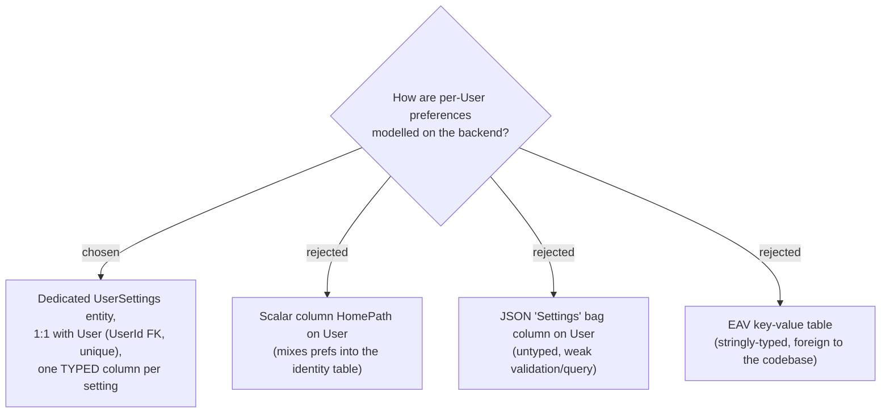

# ADR-083: Per-User preferences live in a dedicated 1:1 typed `UserSettings` entity

**Date:** 2026-07-17
**Status:** Accepted (owner chose a dedicated typed table over a column-on-User or a JSON/EAV bag)
**Relates to:** ADR-081, ADR-082 (Home page is the first setting to use this); `User` entity + `UserConfiguration`; the three `IApplicationDbContext` implementers (CLAUDE.md rule).

## Context

The Home page is MenuNest's **first** per-User preference, so its storage shape sets the precedent for every future setting. The codebase is clean-architecture with **typed** EF entities throughout; a JSON bag or an EAV key-value table would be an untyped, foreign pattern. The owner chose a **dedicated `UserSettings` table** — settings separated from the identity `User` table, but still strongly typed.

## Decision

Introduce a **`UserSettings` entity**, one row per `User`:

- **Shape:** `UserSettings { Id (Guid), UserId (Guid, FK → User, UNIQUE — enforces 1:1), HomePath (string?, nullable) }`, inheriting `Id/CreatedAt/UpdatedAt` from `Entity`. Configured in a new `UserSettingsConfiguration` (`ToTable("UserSettings")`, unique index on `UserId`, `HomePath` max-length bounded).
- **Lazy creation:** the row is created the **first time** the User saves a preference. Absence of a row = "no preferences set yet" (Home page falls back to the default — see the follow-up ADR on resolution).
- **New `DbSet<UserSettings>`** must be added to **all three** `IApplicationDbContext` implementers — `AppDbContext`, `SqliteAppDbContext`, `InMemoryAppDbContext` — in the **same commit** as the entity + config, or the build fails `CS0535` / EF model validation (CLAUDE.md).
- **Future settings** are added as new **typed columns** on `UserSettings` (each with its own migration), never as JSON keys or EAV rows.

## Consequences

**Positive:** strongly typed, clean separation from identity, EF-config-validated, and a clear home for the growing set of user preferences (the localStorage prefs can migrate here in Phase 2). **Negative:** a new `DbSet` touches all three `IApplicationDbContext` implementers and needs a migration; every future setting also needs a migration (the accepted cost of type safety over a JSON/EAV bag).
