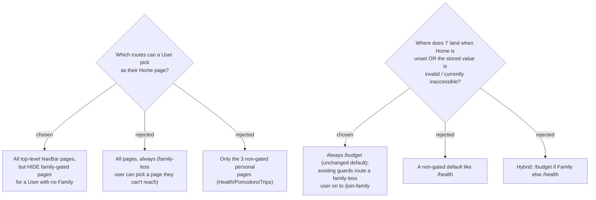

# ADR-084: The Home page selectable set is family-aware; `/` resolves via a validated redirect defaulting to `/budget`

**Date:** 2026-07-17
**Status:** Accepted
**Relates to:** ADR-081 (Home page); ADR-082/083 (storage); the `ProtectedRoute` / `FamilyRequiredRoute` guards and the hardcoded `/` → `/budget` redirect in `frontend/src/router.tsx`.

## Context

Top-level routes split into **personal** (auth-only: `/health`, `/pomodoro`, `/trips`) and **family-gated** (`FamilyRequiredRoute`: `/recipes`, `/stock`, `/meal-plan`, `/shopping`, `/budget`, `/ai-assistant`). A family-less User who lands on a gated route is redirected to `/join-family`. Today `/` is hardcoded to `/budget`.

Two decisions shape how a Home page resolves: **what a User may choose**, and **what happens when there is nothing valid to resolve to**.

## Decision

**1. Selectable set is family-aware (chosen S1).** The Home-page selector offers **all top-level NavBar pages**, but **hides the family-gated pages when the User has no Family** — so a family-less User can only pick a page they can actually reach (no self-inflicted dead-end). A User with a Family sees the full list. The set is derived from a single **home-eligible allowlist**, each entry tagged `requiresFamily: boolean`.

**2. `/` resolves via a validated redirect, default `/budget` (chosen D1).** Replace the hardcoded `<Navigate to="/budget">` with a small **`HomeRedirect`** element that:
   - reads the User's stored `HomePath` (from the `GET /api/me` payload — ADR-082);
   - if it is a **non-empty value present in the allowlist** → `<Navigate to={homePath} replace />`;
   - otherwise (null / empty / unknown / removed route) → `<Navigate to="/budget" replace />`.
   - Whatever route it targets, the existing `ProtectedRoute` / `FamilyRequiredRoute` guards still apply — so a family-gated target (chosen or default) with no Family lands on `/join-family`, exactly as today.

Validating against the allowlist is what prevents a **redirect loop** (a garbage/removed `HomePath` → dead route → catch-all `*` → `/` → …); an unknown value degrades to `/budget`, a real route.

**Rejected:** offering gated pages to family-less users (S2 — dead-ends); restricting to only personal pages (S3 — too limiting); changing the default away from `/budget` (D2/D3 — needlessly changes the landing for every existing family User, none of whom has a stored Home yet).

## Consequences

**Positive:** no existing behavior changes for a User who never sets a Home; the selector can never offer an unreachable page; the validated redirect is loop-proof. **Negative:** the family-gated set must be known in **two** places kept in sync — the `FamilyRequiredRoute` grouping in `router.tsx` and the `requiresFamily` flag on the home-eligible allowlist; a family User who sets Home to a gated page and later leaves their Family will land on `/join-family` until they rejoin or change their Home (accepted — same as the `/budget` default).
