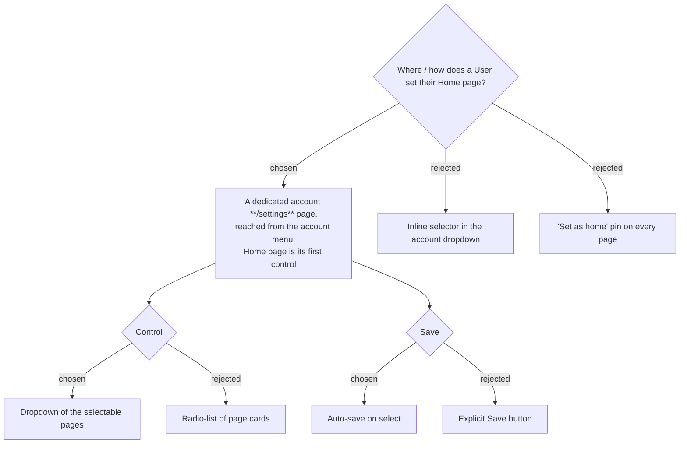

# ADR-085: Home page is set on a dedicated `/settings` page, via an auto-saving family-aware dropdown, reached from the account menu

**Date:** 2026-07-17
**Status:** Accepted (owner confirmed the mock)
**Relates to:** ADR-081 (Home page), ADR-082/083 (storage), ADR-084 (selectable set + resolution); the `NavBar` account menu; `frontend/src/router.tsx` guards.
**Mock:** the **Screens** card `set-home-page` in the Claude Design design-system project **"MenuNest design system"** (`8d8d4c81-41c1-4e0a-a0b7-370b39dfbe70`).

## Context

MenuNest has **no** global account settings page today (only the feature-local `/health/settings`); the account menu holds *Manage ingredients / Manage family / Sign out*. The owner chose a proper account **`/settings`** page as the Home-page control's home — and the natural home for future per-user settings, matching the `UserSettings` backend (ADR-083).

## Decision

Confirmed against the mock:

1. **A new `/settings` route — auth-only.** It sits under `ProtectedRoute` + `AppLayout` but **not** `FamilyRequiredRoute`, so a User with no Family can still open it to pick a personal Home page (`/health`, `/pomodoro`, `/trips`).
2. **Entry point — the account menu.** A **"Settings"** item is added to the account dropdown (desktop) and the mobile drawer, beside *Manage ingredients / Manage family / Sign out*.
3. **Control — a dropdown.** The Home-page control is a dropdown (Syncfusion `DropDownList`) listing the **family-aware selectable set** (ADR-084: all top-level pages, family-gated ones hidden when the User has no Family), with the current Home page preselected. (Rejected: a radio-list of page cards — longer, and the page will grow other settings that read better as labeled rows.)
4. **Save — auto-save on select.** Choosing an option **immediately** persists it (writes `UserSettings.HomePath` via the settings endpoint, ADR-082/083) and shows an inline "saved" confirmation; optimistic, no separate Save button. (Rejected: an explicit Save button — extra step for a single field.)
5. **Copy & icons.** Page title **"การตั้งค่า"**, section **"หน้าแรก (Home page)"** with the sub "หน้าที่จะเปิดขึ้นมาเมื่อเข้าแอป". New elements (the Settings menu entry, the home/gear/check icons) use **`@syncfusion/react-icons`** SVG per `docs/frontend-guidelines.md` — **never emoji**. The page-option list may reuse the existing NavBar page glyphs for recognition; the existing emoji in the NavBar itself are pre-existing legacy and are **not** touched by this change.

## Consequences

**Positive:** a discoverable, conventional settings home that later settings slot into; auto-save is one-tap. The selector can never offer an unreachable page (ADR-084). **Negative:** net-new `/settings` route + page component, and a new entry wired into **both** the desktop account dropdown and the mobile drawer in `NavBar`; the selector must compute the family-aware set on the client, so it needs the User's Family status (already available via `GET /api/me`).
