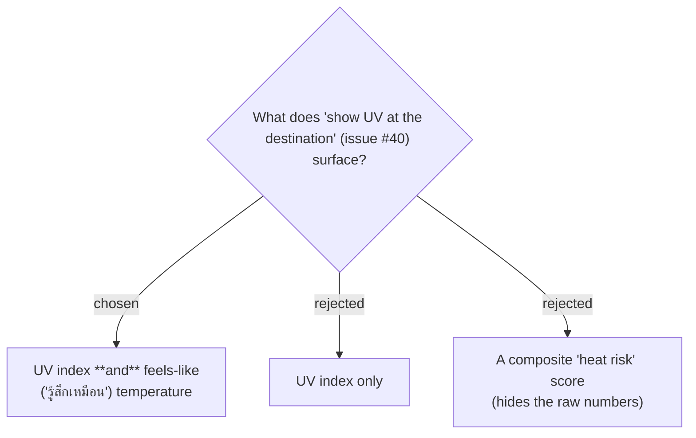

# ADR-086: Issue #40 surfaces two data points on the weather reading — UV index and feels-like temperature

**Date:** 2026-07-19
**Status:** Accepted (owner confirmed the mock)
**Relates to:** issue #40; ADR-029 (two weather readings); `WeatherReading` record; the **UV index** / **Feels-like** glossary terms (CONTEXT.md).
**Mock:** the **Screens** card `issue-40-uv-feels-like` in the Claude Design project **"MenuNest design system"** (`8d8d4c81-41c1-4e0a-a0b7-370b39dfbe70`).

## Context

The issue asks to show the UV value at the destination so the owner can judge — before taking their daughter out to exercise in the evening — whether it will be too hot/sunny. UV alone answers "how strong is the sun"; the felt heat is a separate axis (a humid overcast evening is hot at low UV). The owner chose to surface **both** raw numbers rather than a single opaque score.

## Decision

Each **weather reading** gains two display-only data points — **UV index** (integer, WHO scale) and **Feels-like** temperature (°C). Both sit alongside the existing condition / temperature / rain, and both are shown for the **Now** and **On-arrival** readings (ADR-087). No composite/derived "risk" number is introduced.

## Consequences

**Positive:** transparent raw values; nothing to tune or explain beyond the existing weather chip. **Negative:** +2 fields on the `WeatherReading` record, its DTO, and the frontend types (ADR-093). Raw numbers need interpretation — mitigated by the Thai **UV band** word + colour (ADR-088) and the opt-in **Weather alert** (ADR-087, ADR-089).