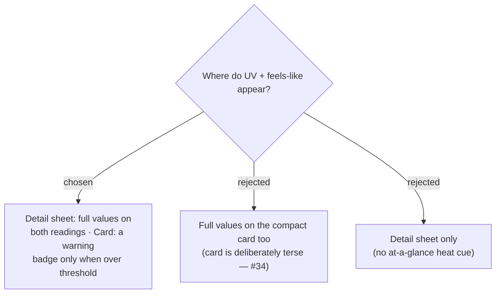

# ADR-087: UV + feels-like show in full in the detail sheet; the compact card carries only a threshold-crossing warning badge

**Date:** 2026-07-19
**Status:** Accepted (owner confirmed the mock)
**Relates to:** ADR-086 (scope); ADR-034 (compact card + detail sheet, issue #34); ADR-089 (thresholds); ADR-092 (arrival-only); `StopDetailSheet`, `WeatherChip`, `ItineraryStopCard`, `stopSummary.ts`.

## Context

The compact itinerary card (issue #34) is deliberately a one-line summary; the detail sheet holds the full weather. But the point of #40 is an at-a-glance "is it too hot/sunny when I arrive" cue **without** opening every stop. So the card shows a warning **only** when it matters; the numbers live in the sheet.

## Decision

- **Detail sheet (`StopDetailSheet`)** — both the **Now** and **On-arrival** `WeatherChip`s gain the feels-like text ("รู้สึก N°") and the coloured **UV badge** (number + Thai band word, ADR-088). Always shown; independent of any setting.
- **Compact card (`ItineraryStopCard` / `stopSummary.ts`)** — no raw UV/feels-like numbers. A **Weather alert** badge appears on the summary line **only** when the **On-arrival** reading crosses the user's threshold (ADR-089, ADR-092); otherwise the card stays exactly as today.

## Consequences

**Positive:** the at-a-glance heat cue without clutter; respects the #34 compact-card intent. **Negative:** two render sites change (the chip and the summary line); the card badge depends on the per-User threshold + the On-arrival reading, so the summary builder now takes the thresholds as input (ADR-092).