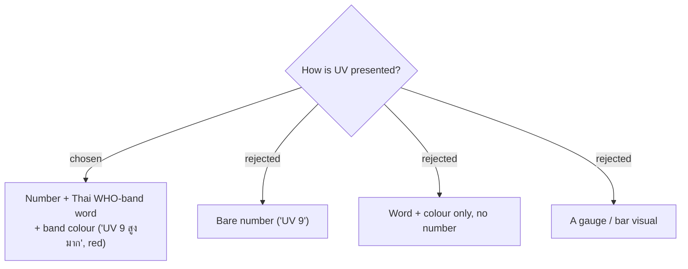

# ADR-088: UV shows as number + Thai WHO-band word + band colour; feels-like as "รู้สึก N°"

**Date:** 2026-07-19
**Status:** Accepted (owner confirmed the mock)
**Relates to:** ADR-086 (scope); ADR-087 (surfaces); the **UV band** glossary term (CONTEXT.md); `lib/weather.ts`, `trips-tokens.css`; CLAUDE.md no-emoji rule.

## Context

A bare UV number means little to a lay user; a word + colour alone loses precision. The owner chose all three — number for precision, Thai WHO-band word for meaning, colour for glanceability. Feels-like is a temperature, shown like the existing temp with a "รู้สึก" prefix.

## Decision

- **UV badge** = the integer + the Thai **UV band** word + the band colour, on the WHO five-band scale (canonical in CONTEXT.md): 0–2 **ต่ำ** (green), 3–5 **ปานกลาง** (yellow), 6–7 **สูง** (orange), 8–10 **สูงมาก** (red), 11+ **อันตราย** (purple). The mapping is a pure helper `uvBand(uv)` → `{ key, word }` in `lib/weather.ts`, unit-tested (the SPA has no component harness — CLAUDE.md).
- **Feels-like** = "รู้สึก N°" (rounded °C) beside the actual temperature in the chip.
- Band colours are CSS tokens in `trips-tokens.css`; any icon is inline SVG / `@syncfusion/react-icons`, **never emoji** (CLAUDE.md).

## Consequences

**Positive:** meaningful at a glance; all band logic in one pure, fully testable helper. **Negative:** five colour tokens added; the band words are now canonical vocabulary (CONTEXT.md) that copy must not drift from.