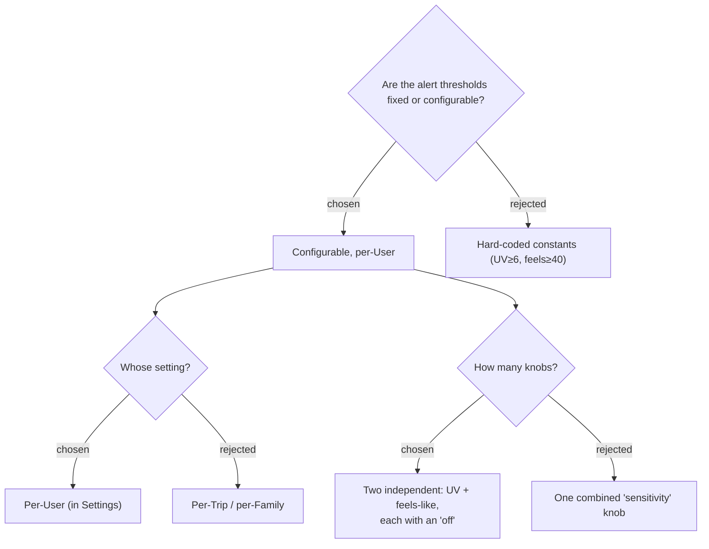

# ADR-089: Weather-alert thresholds are per-User and configurable — two independent thresholds (UV, feels-like), each switchable off

**Date:** 2026-07-19
**Status:** Accepted (owner: "ตั้งค่าได้" · "per-User ในหน้า Settings" · "2 ตัว: เกณฑ์ UV + เกณฑ์ความร้อน")
**Relates to:** ADR-087 (the alert this configures); ADR-083 (UserSettings precedent); ADR-090 (where it is set); ADR-091 (storage); the **Weather-alert threshold** glossary term.

## Context

"Too hot / too sunny" is personal — a threshold that fits one user nags another. The owner chose per-User configurability. UV strength and felt heat are **independent** axes (a humid overcast evening is hot at low UV; a clear cold morning is high UV but not hot), so they get independent thresholds; each can be switched **off** so a user who cares only about UV is not nagged about heat, and vice-versa.

## Decision

Two per-User **Weather-alert thresholds** — one for **UV index**, one for **Feels-like** — set on the `/settings` page (ADR-090). Each is independently settable to a value or turned **off**. Built-in defaults when unset: **UV ≥ 6** (High) and **feels-like ≥ 40 °C**. The concrete option lists (UV: ≥3 / ≥6 / ≥8 / off; feels-like: ≥38 / ≥40 / ≥42 / off) are UI presets over the stored int (ADR-091). Per-User (not per-Trip / per-Family), following the `UserSettings` precedent (ADR-083).

## Consequences

**Positive:** the alert matches each user's own tolerance; the two-axis split lets the compact-card badge show UV, heat, or both (ADR-087). **Negative:** two settings to persist + a Settings UI section (ADR-090) + a tri-state encoding to distinguish default / value / off (ADR-091).