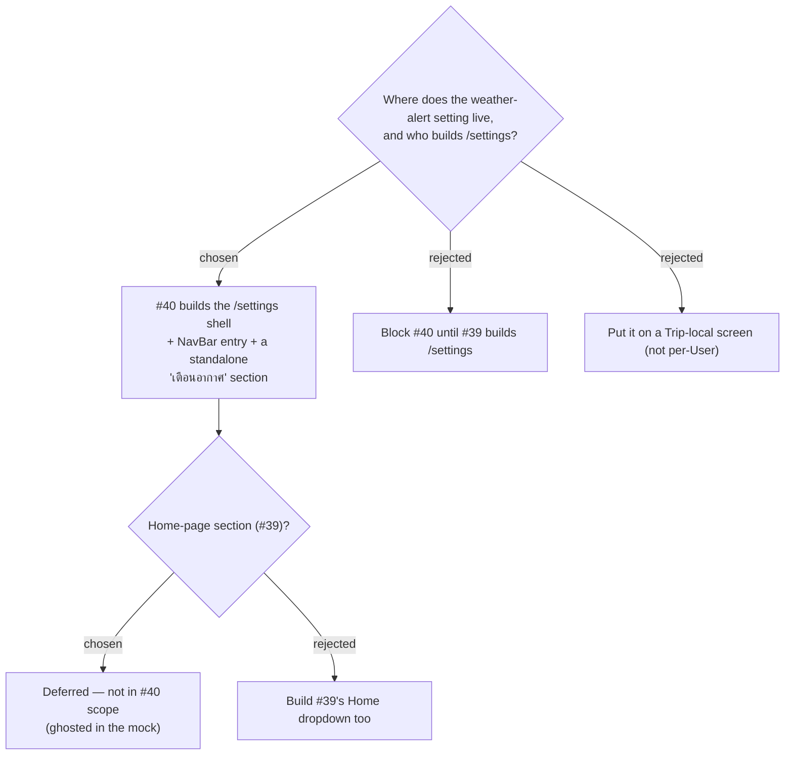

# ADR-090: Issue #40 builds the /settings page shell + a standalone "เตือนอากาศ" section; the Home-page section (#39 frontend) stays deferred

**Date:** 2026-07-19
**Status:** Accepted (owner: "เอาไปรวมหน้า setting แต่แยกส่วน uv"; confirmed the mock's ghosted Home section)
**Relates to:** ADR-085 (#39 designed /settings; its frontend is only partially built so far); ADR-089 (the setting placed here); `frontend/src/router.tsx`, `NavBar`.

## Context

ADR-085 (#39) designed a `/settings` page with a Home-page dropdown, but its frontend is only **partially built** — the pure `homeOptions` lib and the `/` → `HomeRedirect` resolution already exist (committed under #39), yet there is still no `/settings` page, route, or NavBar entry, so a user cannot actually pick a Home page yet. #40 needs a per-User home for its weather-alert setting. Rather than block on #39's frontend, #40 builds the `/settings` shell #39 speced and adds only its own section.

## Decision

- **#40 builds** the `/settings` route (under `ProtectedRoute` + `AppLayout`, **not** `FamilyRequiredRoute` — ADR-085), the `SettingsPage` shell, and the **"Settings"** entry in the desktop account menu **and** the mobile drawer (per ADR-085's design).
- **#40 adds** a standalone **"เตือนอากาศ"** section holding the two threshold dropdowns; the section owns only its own fields.
- **#40 does NOT build** the Home-page dropdown section — that stays #39's frontend work (ghosted/disabled in the mock). When #39's frontend lands it slots its section into the same page, sharing the `UserSettings` row.

## Consequences

**Positive:** #40 ships a usable Settings page without waiting on #39; both features share one page and one `UserSettings` row. **Negative:** #40 absorbs building the page shell #39 designed (accepted — the shell is small and #40 needs it). The existing `/` → `HomeRedirect` resolution (already wired under #39) stays untouched — building `/settings` does not change landing behaviour.