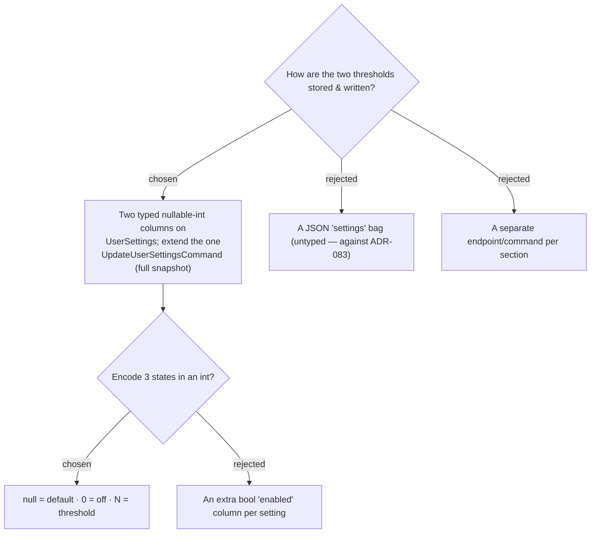

# ADR-091: Thresholds are two nullable-int columns on UserSettings (null=default / 0=off / N=value); the single settings command is extended (full-replace)

**Date:** 2026-07-19
**Status:** Accepted (spec-level; the endpoint/encoding shape is flagged for spec review — see Consequences)
**Relates to:** ADR-083 (typed column per setting), ADR-085 (one extensible `PUT /api/me/settings`), ADR-089 (the two thresholds); `UserSettings`, `UpdateUserSettingsCommand`, `MeDto`; the three `IApplicationDbContext` implementers (CLAUDE.md).

## Context

ADR-083 mandates each new per-User setting be a **typed column** on `UserSettings` (not a JSON/EAV bag), and ADR-085 chose one **extensible** `PUT /api/me/settings`. Each threshold needs **three** states — *default* (never configured → warn at the built-in default), an explicit *value*, and *off*. Crucially, a row created for another setting (e.g. HomePath via #39) leaves these columns `null`, so **`null` must mean "default"**, never "off".

## Decision

- **Two columns** on `UserSettings`: `UvWarnThreshold` (`int?`) and `FeelsLikeWarnThreshold` (`int?`), plus a domain mutator `SetWeatherAlerts(int? uv, int? feels)`. A new migration `AddWeatherAlertSettings`, **applied to prod by hand** (CLAUDE.md). The new members are added to `IApplicationDbContext`'s mapping via `UserSettingsConfiguration` (no new `DbSet` — the entity already exists).
- **Tri-state encoding:** `null` = use the built-in default (UV 6 / feels-like 40); `0` = off (never warn — `0` is not a meaningful "too-hot" threshold, so it is a safe sentinel); a positive value = that threshold. A pure resolver in `lib/weather.ts` maps `null` → default when evaluating the alert.
- **Command:** `UpdateUserSettingsCommand` gains `int? UvWarnThreshold, int? FeelsLikeWarnThreshold`; the handler calls `SetWeatherAlerts` alongside `SetHomePath`. It is a **full-replace** of the settings snapshot — every auto-save sends the complete object (all fields, read from the `GET /api/me` cache), consistent with PUT semantics and ADR-085's single endpoint. `MeDto` gains the two fields.

## Consequences

**Positive:** strongly typed, one endpoint, one migration; sections never clobber each other's fields as long as every save sends the full snapshot from cache. **Negative:** the `0 = off` sentinel is a small piece of magic (mitigated by the named resolver + this ADR); the full-replace contract is an implicit rule the frontend must honour. **This endpoint/encoding shape is the one part not separately grilled** — it is flagged for review when the spec is approved (mirroring ADR-085's endpoint-shape call-out). Rejected: a per-section endpoint (more surface for a two-field page); a JSON bag (violates ADR-083); an extra `enabled` bool column per setting (two extra columns for what a sentinel encodes).