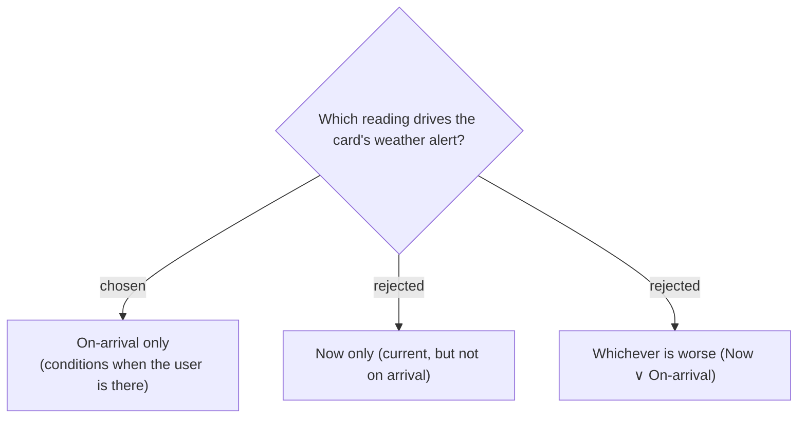

# ADR-092: The compact-card weather alert is evaluated on the On-arrival reading only, not Now

**Date:** 2026-07-19
**Status:** Accepted (owner confirmed the mock example: Now UV 9 → no alert; arrival UV 2 → clean card)
**Relates to:** ADR-087 (the alert); ADR-089/091 (thresholds); ADR-031 (No weather data); the On-arrival-forward `stopSummary.ts`.

## Context

The feature answers "when I take my daughter out **this evening**, will it be too hot/sunny **on arrival**". The midday "Now" UV is irrelevant if arrival is 17:30 when the sun is low — the mock's own example is Now UV 9 but arrival UV 2, which must **not** raise an alert. Alerting on "Now" would nag about conditions the user will not experience.

## Decision

The compact-card **Weather alert** badge (ADR-087) is evaluated against the **On-arrival** reading only. When On-arrival is **No weather data** (past / beyond the forecast horizon / provider failure — ADR-031), **no** alert shows (nothing to warn about). The detail sheet still displays both readings' full UV/feels-like regardless (ADR-087). Thresholds per ADR-089/091.

## Consequences

**Positive:** the badge reflects the moment that matters and is consistent with the compact card's existing On-arrival-forward summary (`stopSummary.ts` already keys off `arrivalReading`). **Negative:** a stop with no arrival forecast shows no heat cue on the card — acceptable, and "Now" remains one tap away in the sheet.