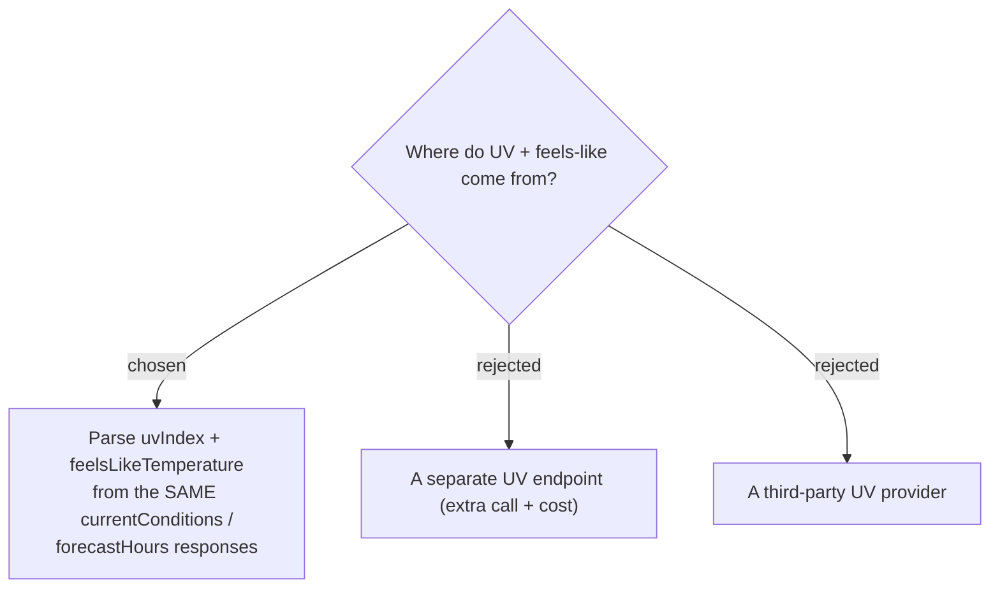

# ADR-093: UV + feels-like are parsed from the existing Google Weather responses — no new API call or cost

**Date:** 2026-07-19
**Status:** Accepted (verified: `uvIndex` + `feelsLikeTemperature` present in both currentConditions and each forecastHours bucket)
**Relates to:** ADR-086 (the two fields); ADR-030 (degrade-to-No-data); `GoogleWeatherService.ParseReading`, `WeatherReading`.

## Context

The Google Weather responses MenuNest already fetches per reading — `currentConditions:lookup` (Now) and `forecast/hours:lookup` (On-arrival), in `GoogleWeatherService` — **already include** `uvIndex` (integer) and `feelsLikeTemperature.degrees` in every bucket (verified against the API). No new request, mask, or provider is needed.

## Decision

`GoogleWeatherService.ParseReading` additionally reads `uvIndex` and `feelsLikeTemperature.degrees` from the element it already parses, populating the two new `WeatherReading` fields. No new HTTP call, **no** new `X-Goog-FieldMask` (the API returns the full document — see the service header note; a wrong mask 400s), no new dependency, no added quota/cost. The existing degrade-to-No-data path (ADR-030) and cache (Now 30 min / On-arrival 3 h) cover the new fields unchanged. The `hasData` rule is unchanged (condition-or-temp present); a bucket missing `uvIndex`/`feelsLikeTemperature` simply yields null for that field and the UI omits that badge.

## Consequences

**Positive:** zero marginal cost and latency; the fields ride the existing batch endpoint, cache, and fallback. **Negative:** coupled to Google's response shape (already true for temp/rain) — a schema change there would drop the new fields to null, degrading gracefully rather than breaking.