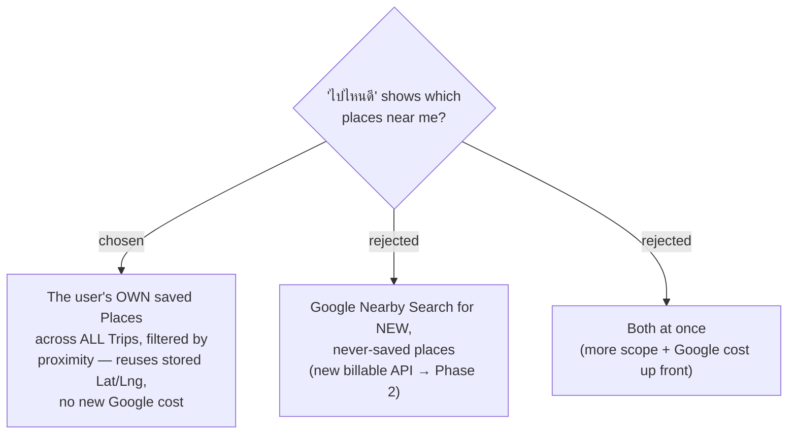

# ADR-094: "ไปไหนดี" place discovery reads the user's own saved Places across Trips — not a new Google Nearby Search

**Date:** 2026-07-20
**Status:** Accepted (Phase 1 scope decision)
**Relates to:** ADR-007 (store only `place_id` + snapshot; one-vendor cost posture); ADR-005 (Trips are User-scoped); ADR-063 (Place profile — User-scoped master keyed by (User, `place_id`)); ADR-027 (viewer live location); ADR-093 ("reuse existing responses — no new cost" posture).

## Context

Places are trapped in Trips. Every persisted-place read requires a `tripId` (`ListTripPlacesQuery` asserts trip ownership, then filters `TripPlaces.Where(p => p.TripId == tripId)`); there is no query, DTO, HTTP endpoint, or MCP tool that returns a User's places across Trips. So a user cannot browse "where can I go near me right now" — the data they already captured is unusable for spontaneous discovery. This is the gap the feature closes.

Two sources were possible:
- **Own saved Places** — aggregate the User's `TripPlace` rows across all Trips. These already carry `Lat`/`Lng`, `GooglePlaceId`, `Name`, `Address`, `Category`, `PhotoUrl` (captured at add-time, ADR-007), so proximity can be computed from data already in our DB.
- **Google Nearby Search** — call Places API (New) `places:searchNearby` around the viewer for brand-new places the user has never saved. This is a new billable call class with no existing usage in the codebase.

## Decision

Phase 1 sources the discovery view **only from the User's own saved Places, aggregated across all their Trips**, filtered and sorted by proximity to the viewer's location. It reuses coordinates already stored (ADR-007), adds **zero** new Google spend (consistent with the ADR-093 no-new-cost posture), and directly solves the "trapped in trips" problem. Discovering brand-new places from Google (Nearby Search) is explicitly **deferred to Phase 2**.

## Consequences

**Positive:** no new Google API or cost; reuses stored place data and the existing geolocation pattern (ADR-027); ships the core value (making saved places discoverable) fast; keeps the app on its one-vendor, place_id-only storage posture.

**Negative / follow-ups:** a user with few saved places sees a short list — discovery is bounded by what they have already captured (the Phase-2 Google source removes this ceiling). It introduces the **first** User-scoped (non-trip-scoped) place read path — a new query, read model / DTO, and endpoint that do not exist today. The same real place captured into multiple Trips is multiple `TripPlace` rows, so the read model must **dedupe by `GooglePlaceId`** and choose a representative snapshot (resolved in a later ADR).
