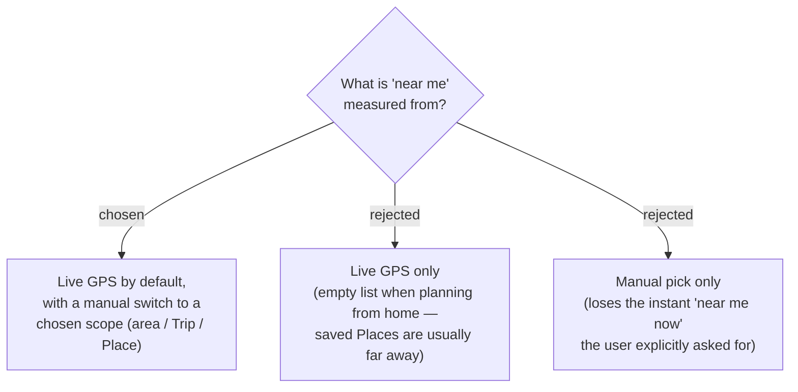

# ADR-095: The "ไปไหนดี" proximity anchor defaults to live GPS, with a manual switch to a chosen scope

**Date:** 2026-07-20
**Status:** Accepted (Phase 1)
**Relates to:** ADR-094 (source = the user's own saved Places across Trips); ADR-027 (viewer live location — `navigator.geolocation`, round to ~4dp, denied/timeout → show nothing).

## Context

The source is the user's own saved Places (ADR-094), which are usually **far** from where the user physically is when they plan. Two concrete scenarios pull in opposite directions: (a) *on-location* — the user is at the destination, and live GPS "near me now" is exactly right; (b) *planning from home* — the user is in Bangkok deciding where to go, live GPS returns Bangkok, and every saved Place is in Chiang Mai, so a GPS-only list is empty. The user explicitly asked for "find current location and near list," so live GPS must be the default, but it cannot be the *only* anchor.

## Decision

The discovery anchor **defaults to the viewer's live location** (reusing the ADR-027 geolocation pattern: `navigator.geolocation`, coordinates rounded to ~4dp). The user can **switch the anchor to a chosen scope** so planning-from-home works, and distance/sort recompute against the active anchor. The concrete switch targets (a picked area vs one of the user's Trips vs a specific saved Place) and the fallback anchor when GPS is denied/unavailable are refined in a later ADR — but the shape is fixed here: **GPS-first, manually overridable**.

## Consequences

**Positive:** covers both the on-trip and at-home scenarios with one screen; reuses the existing geolocation plumbing (ADR-027) and the stored `Lat`/`Lng` on `TripPlace`, so the default path adds no new Google cost.

**Negative / follow-ups:** a switchable anchor adds a control and one piece of state (the active anchor) plus a GPS-denied fallback story (candidate: default to the user's most-recent Trip's area, or prompt to pick a scope). If a switch target is a free-typed *area name*, resolving it to coordinates would be a new Google call — so the zero-cost switch targets (existing Trips / saved Places, whose coordinates we already store) are preferred; a Google-backed area search is Phase-2 territory alongside ADR-094's deferred Nearby Search.
