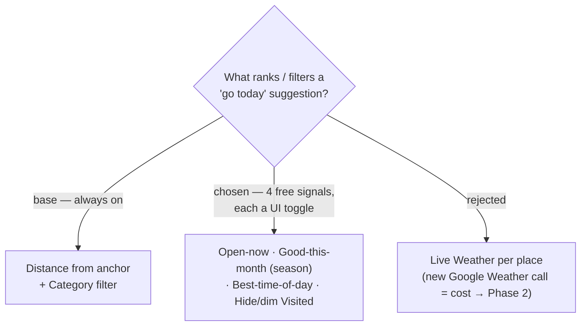

# ADR-096: "ไปไหนดี" layers four free, user-toggleable signals on top of distance + category

**Date:** 2026-07-20
**Status:** Accepted (Phase 1)
**Relates to:** ADR-094 (no new Google cost); ADR-095 (anchor = live GPS/scope → distance); ADR-072 (`monthStatus` season resolver, `lib/season.ts`); ADR-020/021 (Timing-flag "closed" opening-hours check); ADR-038/054 (viewer timezone for "now"); ADR-039/047/048 (Visited is per-**Stop**).

## Context

`TripPlace` already carries, from Capture, everything needed to make "วันนี้ไปไหนดี" smarter than plain proximity — at zero new cost: `OpeningHoursJson` (→ open-now, same evaluation the Timing-flag "closed" check does), `SeasonPeriods` (→ good/avoid this month via the existing `monthStatus` resolver), `BestTimeStart/End` (→ time-of-day match), and per-**Stop** `IsVisited` (→ been-there). The user chose **all four**, with the explicit requirement that **each is a toggle the user can turn on/off in the UI** — signals must not be hardcoded into the ranking.

## Decision

Phase 1 always sorts by **distance** (from the ADR-095 anchor) and filters by **Category**; on top of that it offers **four independently toggleable controls** on the discovery screen:

1. **เปิดอยู่ตอนนี้ (Open-now)** — from `OpeningHoursJson`.
2. **เหมาะกับเดือนนี้ (Season)** — good-this-month up / avoid-this-month down or hidden, via `monthStatus`.
3. **ช่วงเวลาที่ควรไป (Best-time-of-day)** — nudge places whose `BestTime` window matches "now".
4. **ซ่อน/หรี่ที่ไปมาแล้ว (Visited)** — hide or dim places already visited.

All signals are evaluated at read/display time from **data already stored** — no new Google call. **Live weather is explicitly deferred to Phase 2** (it would need a Google Weather call per listed place). The exact per-toggle behaviour (hard filter vs re-sort vs dim) is finalised with the UI mock.

## Consequences

**Positive:** rich "today" relevance at zero marginal cost; the user controls exactly what matters, so a short saved-place list never gets over-filtered to empty by accident.

**Negative / follow-ups:** the read model must expose each place's **raw** signal data (opening hours, season periods, best-time window, and a rolled-up visited flag) so the toggles can apply **client-side and instantly** without re-fetching. Open-now / best-time "now" evaluation needs the **viewer's timezone** (already supplied for Current-time start and weather). "Visited" is per-**Stop** but discovery is per-distinct-**Place**, so the read model must **roll visited up to the place** (visited if any Stop referencing that `place_id` is visited) — settled in the read-model ADR.
