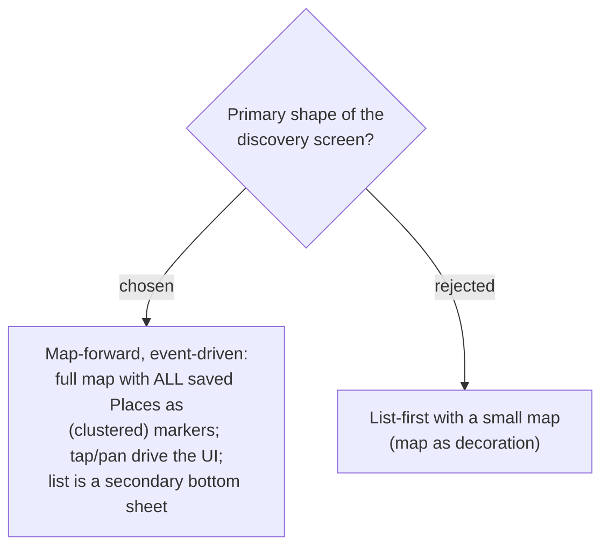

# ADR-097: "ไปไหนดี" is a map-forward, event-driven screen (full map of all saved Places) — not list-first

**Date:** 2026-07-20
**Status:** Accepted (Phase 1)
**Relates to:** ADR-094 (source = all the user's saved Places across Trips); ADR-095 (anchor = GPS + switchable scope); ADR-096 (four toggles + category filter); ADR-026 (existing itinerary map band); the Trip Planner "Map-Forward" direction; existing map stack `@vis.gl/react-google-maps` / `TripMap.tsx` (AdvancedMarker, category `Pin`, viewer pin, FitBounds).

## Context

Direct user decision: *"มันควรเป็นหน้า map แล้วแสดงให้เห็นที่บันทึกไว้ทั้งหมด ชอบ map event driven"* — the discovery screen should be a map that shows all saved Places, with map-driven interaction. This matches the user's consistent map-forward preference (recorded in memory) and reuses the app's existing map stack.

## Decision

The discovery screen is **map-forward and event-driven**:
- The **full map** is the primary surface, showing the user's saved Places across all Trips as **category-coloured markers**, **clustered** when dense (Places span multiple cities/trips).
- The **"you are here" GPS pin** anchors the initial viewport near the user (ADR-095).
- Interaction is **map-driven**: tap a marker → surface that Place (card/sheet with the ADR-098 actions); **pan/zoom → the visible Places and the secondary "nearby" list update to the viewport**. This viewport-as-scope is the concrete realization of ADR-095's "switch scope" — panning to Chiang Mai *is* browsing Chiang Mai, replacing a separate area dropdown.
- The **category filter + four toggles** (ADR-096) control which markers/list items show.
- A **secondary list** (bottom sheet on mobile / side list on desktop) complements the map but is not the primary surface.

Exact layout, cluster styling, and the pan-to-requery behaviour are confirmed with the UI mock before build.

## Consequences

**Positive:** reuses the existing map stack and category-pin/viewer-pin patterns; one gesture (pan/zoom) serves both "near me" and "browse elsewhere"; matches the user's map-forward preference.

**Negative / follow-ups:** showing **all** saved Places needs **marker clustering**, which `TripMap` does not do today (new dependency or component); a sensible initial viewport/zoom must be chosen (near GPS, or fit-all when GPS denied). Map-forward UI is invisible to the node-env test suite, so it **must be verified interactively before any push** (CLAUDE.md #36 black-map lesson). Pan-to-requery must debounce and, in Phase 1, filter an already-loaded client-side set (all the user's Places are fetched once) rather than round-trip per pan.
