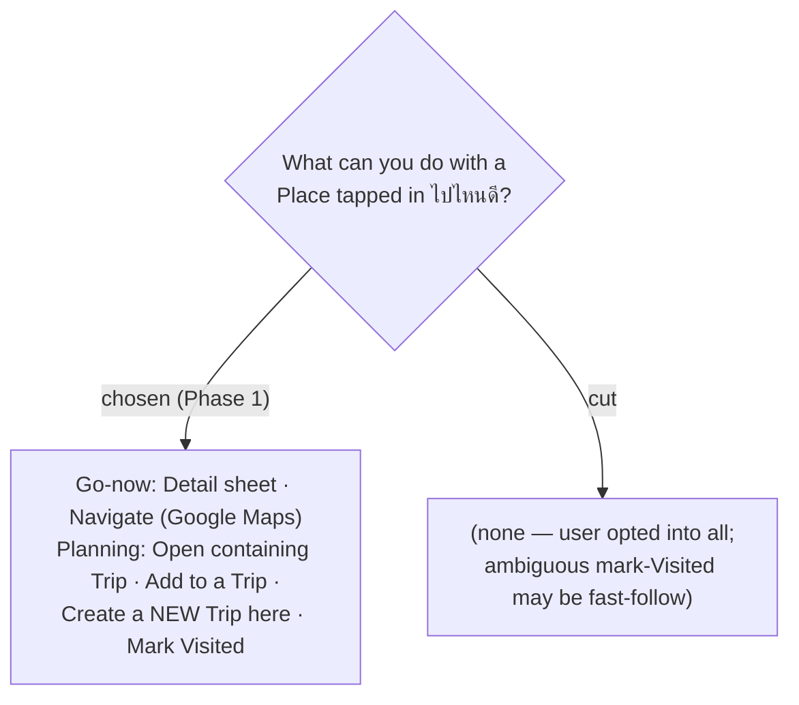

# ADR-098: Actions on a Place in "ไปไหนดี" — go-now + planning, including start-a-new-trip

**Date:** 2026-07-20
**Status:** Accepted (Phase 1; mark-Visited semantics + trip-disambiguation resolved in the spec)
**Relates to:** ADR-011 (Navigate hand-off to Google Maps); ADR-067/068/070 (Capture from the itinerary add-stop path, `AddTripPlace`); ADR-063/064 (Place profile seed-on-capture); ADR-039/047/048 (Visited is per-**Stop**); ADR-097 (map-forward shell — actions hang off a tapped marker).

## Context

The user selected every offered action and added one: **create a new Trip from a discovered Place**. So discovery is not a dead-end browse — it closes the loop into both *doing* (navigate) and *planning* (open/add/create Trip).

## Decision

A tapped Place offers:

**Go-now**
1. **Detail sheet** — reuse the existing place-detail components (snapshot, opening hours, season, best-time, review links, checklist) plus "อยู่ในทริป: …".
2. **Navigate hand-off** — open the external Google Maps app for real turn-by-turn (ADR-011).

**Planning**
3. **Open containing Trip** — jump to the Trip that holds this Place.
4. **Add to a Trip** — add this Place to another existing Trip (reuse `AddTripPlace` + seed-on-capture, so enrichment carries over via the Place profile).
5. **Create a new Trip here** — start a new Trip seeded with this Place as its first `TripPlace`.
6. **Mark Visited** — mark the Place "มาแล้ว".

## Consequences

**Positive:** discovery flows back into the rest of the app using existing Capture/AddTripPlace/PlaceProfile plumbing, so add/create inherit the user's enrichment for free.

**Negative / to resolve in the spec:**
- A Place can be in **multiple** Trips → "Open containing Trip" and the containing-trip label must **disambiguate** (list the trips); "Add to a Trip" needs a **trip picker**.
- "Create a new Trip here" needs the new-Trip flow to accept a seed `place_id` (create Trip → `AddTripPlace`).
- **Mark Visited is per-Stop**, but a discovered Place may map to **zero or many** Stops. "Mark visited here" is only well-defined when the Place is a Stop in a specific Day/Trip. The spec must define the target (e.g. only enabled when unambiguous, or choose which Stop) — given the ambiguity, **Mark Visited may land as a fast-follow** rather than day-one, even though it was selected.
