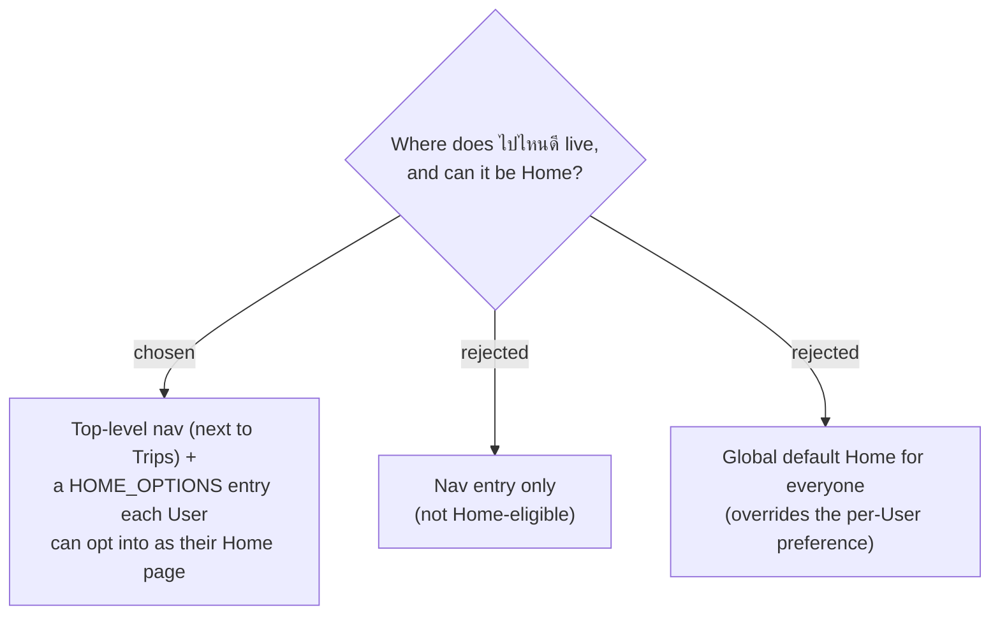

# ADR-099: "ไปไหนดี" is a top-level destination and a selectable Home page (opt-in, not global default)

**Date:** 2026-07-20
**Status:** Accepted (Phase 1)
**Relates to:** ADR-081/082/085 (per-User Home page + `HomeRedirect` + `HOME_OPTIONS`); ADR-005 (Trips are User-scoped, not family-gated); ADR-097 (the map-forward Discover screen).

## Context

The feature is framed as "**วันนี้**ไปไหนดี" — a daily "what should I do today" entry point, which makes it a natural landing page. The app already has a per-User Home page mechanism (ADR-081): `/` → `HomeRedirect` → `resolveHomePath(homePath)`, choosing from `HOME_OPTIONS` (default `/budget`).

## Decision

- Register a new **`/discover`** route in the **auth-only `AppLayout`** group (alongside `/trips` — requires sign-in, **not** a family), per the frontend routing map.
- Add one entry to **`NavBar` `navItems`** (covers desktop nav + mobile drawer in one place).
- Add **`/discover`** to **`HOME_OPTIONS`** with `requiresFamily: false`, so a User can set it as their Home page on `/settings`; `resolveHomePath` must recognise it as home-eligible.
- **Do not** change the global default (`/budget` stays the default per ADR-081). Landing on ไปไหนดี is **opt-in per User**.

## Consequences

**Positive:** reuses the existing Home-page plumbing unchanged except for the new option; a single `navItems` addition surfaces it everywhere; users who live in "where to go today" can make it their front door without forcing it on anyone.

**Negative / follow-ups:** `HOME_OPTIONS` / `resolveHomePath` and their tests must include `/discover`; the nav label follows the app's icon convention (inline SVG, not emoji — see the mock note).
