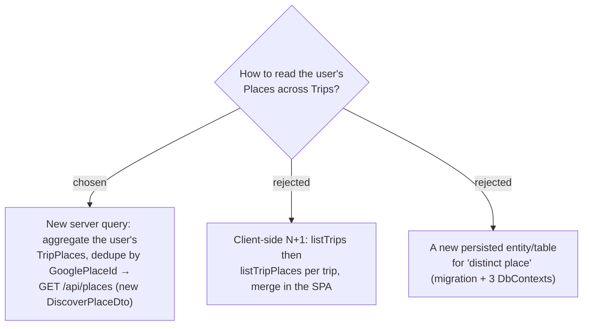

# ADR-100: Discovery read model — a new User-scoped `GET /api/places` aggregating distinct saved Places across Trips (no new entity)

**Date:** 2026-07-20
**Status:** Accepted (Phase 1; technical decision)
**Relates to:** ADR-094 (source = own saved Places across Trips); ADR-096 (toggles need raw per-place signal data); ADR-097 (client-side filtering of one loaded set); ADR-063 (PlaceProfile stores only enrichment — no name/coords); the `TripPlace` schema (`Lat`/`Lng`/`GooglePlaceId`/`Category`/`OpeningHoursJson`/`SeasonPeriods`/`BestTime`); `ICurrentUserService`/`GetOrProvisionCurrentAsync`.

## Context

No cross-trip place read path exists — every query needs a `tripId` (ADR-094). `PlaceProfile` is keyed `(UserId, GooglePlaceId)` and durable but stores **only enrichment** (no name/coords/category), so it cannot back a browsable list alone. `TripPlace` **does** carry coords, name, category, and every signal the toggles need — but one row per (Trip, place), so the same real place across two Trips is two rows.

## Decision

Add **`GET /api/places`** — a User-scoped read (user resolved via `GetOrProvisionCurrentAsync`, like all personal data) backed by a new query/handler that:
- Aggregates the User's `TripPlace` rows across **all** their Trips and **dedupes by `GooglePlaceId`** (representative = the most-recently-updated row). `TripPlace` rows with a **null** `GooglePlaceId` (unresolved) are each their own item.
- Returns a new **`DiscoverPlaceDto`** carrying: coordinates + `Category` + `PhotoUrl` + `Name` + `Address`; the **raw** signal fields (`OpeningHoursJson`, `SeasonPeriods`, `BestTimeStart/End`) so the client computes open-now / season / best-time itself; a **rolled-up `Visited`** flag (true if **any** `Stop` referencing that place is visited); the list of **containing Trips** (`{id, name}`); and `HasProfile`.
- Adds **no new entity, table, `DbSet`, or migration** — it is a read over existing tables (`TripPlaces`, `Stops`→`ItineraryDay`, `PlaceProfiles`).

The SPA fetches this **once** and computes **distance** (from the ADR-095 anchor) and the four signals, applying the toggles and the viewport/scope filter **client-side** (matches ADR-097's pan-filters-the-loaded-set).

## Consequences

**Positive:** no schema change / migration / three-DbContext edit; toggles and pan are instant (no re-fetch); reuses `Haversine` for distance and `lib/season.ts` `monthStatus` for season on the client.

**Negative / to-resolve-in-spec:** the LINQ must group by `GooglePlaceId`, join `Stops` (via `ItineraryDay`→`TripPlace`) for the visited roll-up, and gather containing Trips — non-trivial; the null-`place_id` branch needs an explicit identity. The whole saved-place set loads at once (fine for a personal app; paginate/curse later if a user's set grows huge). The new DTO name must avoid the banned **Location** term (it is `DiscoverPlaceDto`, surfacing distinct **Places**).
