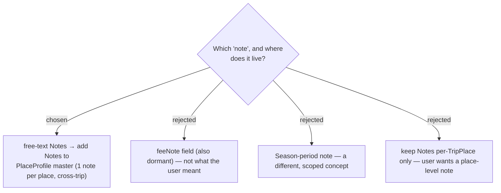

# ADR-101: "Note" means the free-text `Notes` field, elevated to a User-master (`PlaceProfile`) attribute

**Date:** 2026-07-20
**Status:** Accepted (Phase 1)
**Issue:** [#44](https://github.com/ThodsaphonSonthiphin/MenuNest/issues/44) — ไปไหนดี ต้องมี tiktok/relate link + note แสดง.
**Relates to:** ADR-063 (PlaceProfile master keyed by (User, place_id)); ADR-049 (Review link is *not* the Notes field); the dormant `TripPlace.Notes`.

## Context

The issue asks Discover to show "the note" for a place. Code check: `TripPlace.Notes`
(free-text) exists in domain/DTO/API but is **dormant** — no UI input populates it, and
`feeNote` is the same. The user confirmed they mean the **free-text `Notes`**, and framed it
as "a note **about this place**" — a property of the place across trips, not one trip.

The `PlaceProfile` master (User + `place_id`) already holds the cross-trip enrichment
(best-time, review links, season, checklist) but has **no `Notes` field**.

## Decision

Add **`Notes` (nullable string, capped)** + `SetNotes(...)` to the `PlaceProfile` master, making
the note a **User-scoped, per-place, cross-trip attribute**. `TripPlace.Notes` is kept (for the
per-trip card display and as the no-`place_id` fallback), but the master is the source of truth
for the cross-trip Discover view. Persistence: a new column + EF migration `AddPlaceProfileNotes`,
**applied to prod by hand** (CLAUDE.md — neither app nor CD runs `Database.Migrate()`).

## Consequences

**Positive:** matches the user's mental model (one note per place); reuses the existing master
architecture. **Negative:** a new column + manual migration; the note now has two homes
(`TripPlace.Notes` per-trip + `PlaceProfile.Notes` master) reconciled by write-through (ADR-103).
