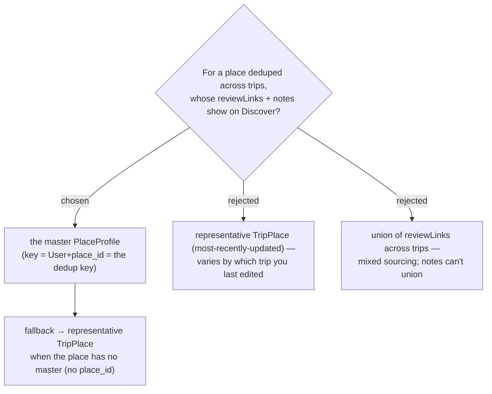

# ADR-102: Discover sources Review links + Notes from the master `PlaceProfile`, falling back to the representative `TripPlace`

**Date:** 2026-07-20
**Status:** Accepted (Phase 1)
**Issue:** [#44](https://github.com/ThodsaphonSonthiphin/MenuNest/issues/44)
**Relates to:** ADR-100 (Discover dedupes `TripPlace`s by `GooglePlaceId`, representative = most-recently-updated); ADR-063 (master keyed by (User, `place_id`) — the same key Discover dedupes on); ADR-101 (Notes added to master); ADR-103 (write-through keeps the master fresh).

## Context

A Discover pin = many `TripPlace` rows deduped by `GooglePlaceId` (ADR-100). Review links and
notes live per-`TripPlace`, so "which trip's" is ambiguous. Discover's dedup key **is** the
master's key `(User, place_id)`, so the master is the natural per-place source; the user chose
"from master" for both, for consistency.

## Decision

`ListMyPlacesHandler` looks up the master `PlaceProfile` for each grouped `GooglePlaceId` and
surfaces **`master.ReviewLinks` + `master.Notes`** on the new `DiscoverPlaceDto` fields. When a
place has **no master** (no `GooglePlaceId`, e.g. an unresolved place), it **falls back** to the
representative `TripPlace`'s `ReviewLinks` / `Notes`. The master is kept fresh by write-through
(ADR-103), so the master value is never stale relative to the last edit.

## Consequences

**Positive:** one deterministic value per place, matching the cross-trip nature of Discover;
review links come "for free" (already on the master). **Negative:** the query gains a
`PlaceProfiles` join keyed on `GooglePlaceId`; correctness depends on write-through (ADR-103) —
without it the master would lag and this decision would show stale data.
