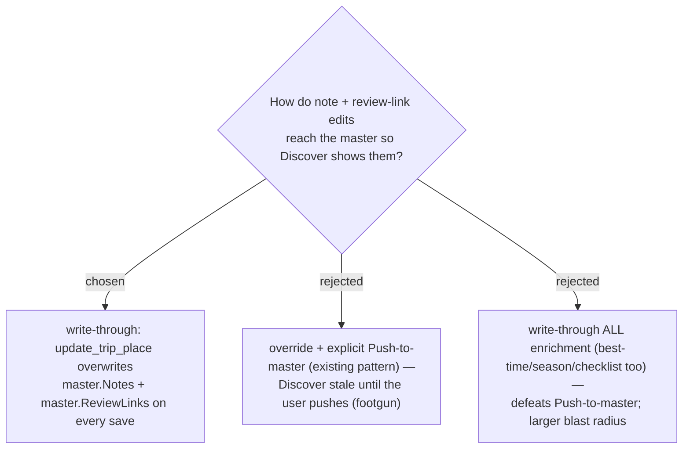

# ADR-103: `update_trip_place` writes Notes + Review links through to the master immediately; other enrichment stays push-only

**Date:** 2026-07-20
**Status:** Accepted (Phase 1)
**Issue:** [#44](https://github.com/ThodsaphonSonthiphin/MenuNest/issues/44)
**Relates to:** ADR-064 (per-trip override; enrichment reaches master only via explicit Push-to-master); ADR-102 (Discover reads the master); ADR-051 (Review links reuse `updateTripPlace`).

## Context

Discover reads the master (ADR-102). Under the existing model (ADR-064), review links reach the
master only on explicit **Push-to-master**, so an edit made in a trip would **not** appear on
Discover until pushed — the exact footgun we removed for the note. The user accepted a small,
deliberate semantics change to keep both fields fresh.

## Decision

In `UpdateTripPlaceHandler`, after applying the per-`TripPlace` edits, **write-through**
`Notes` and `ReviewLinks` to the master `PlaceProfile` (create it if absent; otherwise overwrite
just those two fields) whenever the place has a `GooglePlaceId`. **Best-time, season periods, and
the checklist item-set stay push-only** — they still reach the master only via first-enrichment
auto-create or explicit `push_place_profile`. The MCP `update_trip_place` **signature is
unchanged** (it already carries `notes` + `reviewLinks`); only the tool description notes the new
propagation. No-`place_id` places are a no-op (their note/links live on the `TripPlace`, read via
the ADR-102 fallback).

## Consequences

**Positive:** AI or the editor sets a note/review link once and it shows on Discover instantly, no
push step. **Negative:** notes + review links now diverge from the "override until pushed"
behaviour of the other enrichment fields (a deliberate, documented asymmetry); editing links in
one trip updates the shared master (and thus what a future capture seeds), which is acceptable for
a single-user app.

**Last-write-wins across trips (accepted, 2026-07-20):** because `update_trip_place` is a
full-replace of `Notes`/`ReviewLinks`, a save from **any** trip sharing the same `GooglePlaceId`
overwrites the shared master — including a save whose own note/links are empty (e.g. a save that
only changed category or best-time). Concretely: Trip A sets a note + review link on a place
(master gets them); Trip B later saves the same place with no note/links (perhaps only editing an
unrelated field) and the master's note/links are wiped back to empty, even though Trip A never
touched anything. The human explicitly accepted this over a non-destructive (merge-on-save)
variant, to keep the write-through rule simple (full-replace, not a 3-way merge). Mitigations: (1)
re-save from the trip whose values should win, last save takes effect; (2) each `TripPlace` keeps
its own `Notes`/`ReviewLinks` copy independent of the master, so per-trip data is never lost — only
the shared master and what Discover/future captures see is affected. See
`PlaceProfileWriteThroughRelationalTests.Write_through_is_last_write_wins_across_trips` for a test
that reproduces this.
